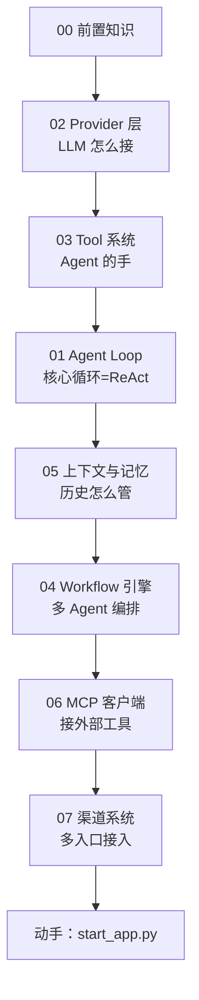

# 前置知识速览：从后端开发到 AI Agent

> 面向有 2 年后端经验的开发者，补充进入 AI Agent 领域所需的基础概念。

---

> 💡 本篇是 8 篇系列的总入口。建议先读下面「项目地图」建立全局心智模型，再按依赖顺序下钻。

## 🎯 一句话定义

**CountBot 是一个手写 Agent 框架（v0.9.0，Python/FastAPI + Vue3）：不依赖 LangChain，自己实现「LLM 接入 → 工具 → 核心循环 → 记忆 → 多 Agent 编排 → 外部协议 → 渠道入口」全链路。**

## 🗺️ 项目地图：8 篇怎么读（30 秒看懂）



**读法**：先懂「LLM 接入」和「工具」，才能看懂「核心循环」怎么把它们串起来；之后才是「记忆、编排、协议、入口」。

## 📑 速查表（10 秒定位）

| # | 文章 | 一句话职责 | 核心源码 | 难度 |
|---|------|-----------|---------|------|
| 00 | 前置知识 | 后端→AI Agent 的概念补丁 | — | ⭐ |
| 01 | Agent Loop | 把 LLM 推理和工具执行连成循环 | `agent/loop.py` | ⭐⭐⭐ |
| 02 | Provider 层 | 统一几十家 LLM API | `providers/` | ⭐⭐ |
| 03 | Tool 系统 | 给 LLM 可调用的函数 | `tools/` | ⭐⭐ |
| 04 | Workflow | 多 Agent 三种协作模式 | `agent/workflow.py` | ⭐⭐⭐ |
| 05 | 上下文/记忆 | 三层窗口管理 | `session/context_service.py` `agent/memory.py` | ⭐⭐⭐ |
| 06 | MCP 客户端 | Agent-to-Tool 标准协议 | `mcp/` | ⭐⭐ |
| 07 | 渠道系统 | 13 个 IM 统一接入 | `channels/` | ⭐ |

## ✅ TL;DR（读完这段就懂这篇在讲啥）

- 本篇是「总目录」：补概念 + 指路，不深入代码
- 8 篇按依赖排序：Provider → Tool → Loop → 记忆 → Workflow → MCP → 渠道
- 系列围绕同一个项目 CountBot，建议配合源码 `backend/` 对照阅读

---

## 你需要知道什么

### 已经有了的（后端基础）

| 概念 | 说明 |
|------|------|
| HTTP/REST API | FastAPI 的路由、请求/响应模型 |
| 异步编程 | Python `async/await`、`asyncio` |
| 数据库 | SQLAlchemy ORM、SQLite |
| WebSocket | 全双工通信 |
| 设计模式 | 策略模式、工厂模式、IoC、单例 |
| JSON Schema | 参数验证和结构化数据描述 |

### 需要补充的（AI/LLM 基础）

---

## 1. LLM 是怎么工作的

### 1.1 Token（令牌）

LLM 不是按「字」来理解文本的，而是按 **token**。一个 token 大约等于：
- 英文：~0.75 个单词
- 中文：~0.5-1 个汉字

**为什么重要**：LLM 按 token 计费，且有上下文窗口（context window）限制。CountBot 的上下文管理系统就是为了在有限的 token 预算内塞入最多的有用信息。

```python
# 一个直观的例子
"Hello world" → 2 tokens
"你好世界" → 3-4 tokens
```

### 1.2 System Prompt vs User Message vs Assistant Message

LLM 的输入是一组「消息」，每一条有角色：

```
[
  {"role": "system", "content": "你是一个有用的助手"},     # 系统提示词：定义角色和规则
  {"role": "user", "content": "今天天气怎么样？"},          # 用户消息
  {"role": "assistant", "content": "请问你在哪个城市？"},   # AI 回复
  {"role": "user", "content": "北京"},                      # 用户回复
]
```

- **system**：定义 AI 的角色、能力边界、行为规则（在 CountBot 中由 `ContextBuilder.build_system_prompt()` 生成）
- **user**：用户输入
- **assistant**：AI 的历史输出
- **tool**：工具调用的结果（见下文）

**在 CountBot 中的对应**：`ContextBuilder.build_messages()` [context.py:512-566](backend/modules/agent/context.py#L512-L566)

### 1.3 Function Calling / Tool Use

这是 Agent 区别于普通 Chatbot 的核心能力。LLM **不只是生成文本**——它能决定「我现在需要调用一个函数」。

**流程**：
```
1. 你告诉 LLM：「你有这些工具可用：read_file, exec, web_fetch...」
   ↓
2. LLM 推理后决定：「我需要先读取错误日志」
   ↓
3. LLM 返回的不是文本，而是一个 tool_call：
   {"name": "read_file", "arguments": {"path": "data/logs/app.log"}}
   ↓
4. 你的程序执行 read_file("data/logs/app.log")
   ↓
5. 把执行结果追加回对话：「read_file 的结果：Error: connection timeout...」
   ↓
6. LLM 看到结果后继续推理：「是连接超时，我建议检查网络配置」
```

**在 CountBot 中的对应**：`AgentLoop.process_message()` 中的 tool_calls_buffer 处理 [loop.py:331-606](backend/modules/agent/loop.py#L331-L606)

### 1.4 Temperature（温度）

控制 LLM 输出的「随机性」，范围 0-2：
- **0**：确定性最强，同样的输入得到同样的输出（适合代码生成、事实查询）
- **0.7-1**：有一定创造性（适合写作、头脑风暴）
- **>1**：非常随机，可能胡言乱语

CountBot 默认 `temperature=0.0`，偏向确定性和可靠性。

### 1.5 上下文窗口（Context Window）

LLM 一次能「看到」的最大 token 数。超过这个限制：
- 最旧的消息会被截断
- 或者你需要做总结/压缩

CountBot 的三层上下文管理就是为了解决「窗口不够用但信息不能丢」的矛盾。

---

## 2. AI Agent 核心概念

### 2.1 什么是 Agent

> **Agent = LLM + 工具 + 循环**

传统程序：
```python
if user_input == "查天气":
    result = weather_api("北京")
    return f"北京今天{result}"

# 问题：只能处理预定义的情况
```

Agent：
```python
# 你只需要告诉 LLM 有什么工具，它自己决定用什么
tools = [weather_api, file_reader, shell_executor, web_searcher]
# LLM 推理：「用户想知道天气 → 我需要调 weather_api → 参数是"北京"」
# 如果 weather_api 失败了，LLM 可能会自己尝试 web_searcher 作为替代
```

### 2.2 ReAct 模式（Reasoning + Acting）

Agent 核心工作模式，来自 2022 年 Yao et al. 的论文：

```
Loop:
  1. Thought（思考）: 「用户想知道天气，我需要调 weather_api」
  2. Action（行动）: 执行 weather_api(city="北京")
  3. Observation（观察）: 拿到结果 "25°C，晴"
  4. Thought: 「信息足够了，我可以回答用户了」
  5. 输出最终回复
```

**在 CountBot 中的对应**：`AgentLoop.process_message()` 的整个 while 循环

### 2.3 Multi-Agent（多智能体协作）

多个 Agent 协同工作：
- **Pipeline（流水线）**：一个接一个，像工厂流水线
- **Graph（依赖图）**：有依赖关系的并行执行
- **Council（评审会）**：多视角独立分析后交叉讨论

**在 CountBot 中的对应**：`WorkflowEngine` [workflow.py](backend/modules/agent/workflow.py)

### 2.4 MCP（Model Context Protocol）

Anthropic 提出的 Agent-to-Tool 通信标准协议。让 Agent 以标准化方式连接外部工具服务。

- **stdio 传输**：启动一个子进程，通过标准输入/输出通信
- **SSE 传输**：通过 HTTP Server-Sent Events
- **Streamable HTTP**：通过 HTTP 流式传输

**在 CountBot 中的对应**：[client.py](backend/modules/mcp/client.py)

---

## 3. 学习路径推荐

### 如果你只有一周

| 天 | 内容 | 目标 |
|----|------|------|
| 1 | 本文 + 动手跑起来项目 | 建立全局认知 |
| 2 | [Agent Loop 深度解析](01-agent-loop.md) | 理解核心循环 |
| 3 | [Provider 层深度解析](02-provider-layer.md) | 理解 LLM 抽象 |
| 4 | [Tool 系统深度解析](03-tool-system.md) | 理解工具机制 |
| 5 | [Workflow 引擎深度解析](04-workflow-engine.md) | 理解多 Agent |
| 6-7 | [上下文与记忆](05-context-memory.md) + [MCP](06-mcp-client.md) | 补齐周边 |

### 如果你有两周

再加上：
- [Channel 系统](07-channel-system.md)
- 动手修改一个工具，观察 Agent 行为变化
- 创建一个自定义 Agent Team，尝试 Pipeline/Graph/Council 三种模式
- 阅读 [架构优化文档](../architecture-optimization.md)，理解设计权衡

---

## 4. 关键文件速查（阅读顺序）

| 优先级 | 文件 | 为什么先读 | 行数 |
|--------|------|-----------|------|
| ⭐⭐⭐ | `backend/modules/agent/loop.py` | 项目心脏，ReAct 循环 | ~730 |
| ⭐⭐⭐ | `backend/modules/providers/base.py` | LLM 抽象基类，理解统一接口 | ~50 |
| ⭐⭐⭐ | `backend/modules/tools/base.py` | 工具抽象基类 | ~50 |
| ⭐⭐ | `backend/modules/agent/workflow.py` | 多 Agent 编排 | ~600 |
| ⭐⭐ | `backend/modules/agent/context.py` | 上下文构建 | ~770 |
| ⭐⭐ | `backend/modules/providers/openai_provider.py` | LLM 调用具体实现 | ~1200 |
| ⭐ | `backend/modules/agent/subagent.py` | 子 Agent 管理 | ~890 |
| ⭐ | `backend/modules/session/context_service.py` | 上下文维护 | ~660 |
| ⭐ | `backend/modules/mcp/client.py` | MCP 协议 | ~880 |

---

## 🔧 为什么这份学习路径这样编排（Why）

### 为什么假设读者有「2 年后端经验」？
因为 CountBot 是**工程向**的 Agent 框架，核心价值在"如何把 LLM 工程化落地"，而不是 ML 理论。读者已有 HTTP / 异步 / ORM / 设计模式基础，文档就能跳过"什么是 REST"这类铺垫，直接讲 `AgentLoop` 如何用 `asyncio` 并发跑工具、如何用 `contextvars` 做并发隔离。若从零讲 ML，会稀释真正要交付的重点——一个能上生产的 Agent 系统由哪些零件组成、各自为什么存在。

### 为什么先讲 Token / Context Window，再讲 Agent？
因为 **token 是 Agent 系统的第一性成本与约束**：工具定义要塞进 context、长对话要压缩、预算要按 token 算。`00` 把 token 经济讲透，后续 `05-context-memory` 的三层压缩、`03-tool-system` 的 prompt cache 排序才有支点。不理解"窗口有限、token 要钱"，就理解不了项目里每一处"为什么这样省"。

### 为什么偏手写框架，而不是一上来教 LangChain？
CountBot 源码本身就是"手写 Agent 框架"的最佳教材。读懂它，你获得的是"Agent 框架由哪些零件组成、各自为什么存在"，而不是"某个库的 API 用法"。这直接对应面试官最爱问的「框架选型：轻量 vs 重量级、何时不该用框架」（Q94）——只有懂手写，才知道何时该用框架、何时框架是负担。

### 为什么把 MCP / RAG / 向量库排除在入门范围外？
诚实说明：CountBot v0.9.0 **目前没有** embedding / 向量检索 / RAG（这是面试中反复被点名的真实短板，见 `interview-digest`）。入门阶段不引入不存在的能力，避免读者产生"项目已经有 RAG"的误解。等读完 `05` 上下文与记忆，再在进阶篇讨论如何补这块、以及补之前先用纯摘要方案能覆盖多少。

### 为什么强调「默认 temperature=0」？
因为本项目的工程取向是**确定性与可复现**：Agent 会跑命令、改文件，胡言乱语的代价极高。这和"聊天机器人追求创意"的默认不同——这是设计取舍，不是巧合。理解这一点，才能理解后面 Provider 层、Workflow 层一系列"保守、可控"的选择。

---

## 🛠️ 落地实施路径：怎么用这份文档（How）

### 路径 A：按周计划动手，别只读
第 1 天就必须 `python start_dev.py`（或 `start_app.py`）把项目跑起来，在 Web UI 发一条"帮我读取 README.md 的前 20 行"。你要**亲眼看到**：system prompt 怎么拼出来、LLM 怎么返回 `tool_call`、工具结果怎么回填进消息、最终答案怎么流回来。只读不跑，等于没学——这步建立的直觉比读 10 篇文档都重要。

### 路径 B：学完 01–03 后，选一个「第一个贡献」练手
挑一个低风险 PR，在真实代码里验证前面所有概念：
- **加一个工具**（`03` 练习 1 的 `DateTimeTool`）—— 熟悉 Tool 抽象与注册表。
- **加一个 Provider**（`02` 路径 A）—— 熟悉 registry 驱动。
这两个都是"加一个类 + 注册"的范式，能让你把抽象概念落成肌肉记忆。

### 路径 C：把面经当「掌握度雷达」
`interview-digest/` 下是按真实面试题组织的逐题解析（累计 96 题）。每学完一个模块，去对应主题找 2–3 题自测："我能用 CountBot 真实代码回答吗？" 答不出就回读源码。这能把"看懂"升级为"能讲"。

### 路径 D：建立源码书签，按依赖顺序精读
按本文第 4 节「关键文件速查」把 `loop.py` / `providers/base.py` / `tools/base.py` 钉到 IDE 书签。读不懂某个函数时，用 `git blame` 看它的演进，理解"为什么变成现在这样"——文档描述现状，git 历史解释成因。

### 路径 E：连接面试视角（推荐但可选）
建议在读完 `01–03` 后，回到 `interview-digest` 找「Agent 核心机制与循环」「工具系统与可靠性」主题下的题，尝试不查文档口述一遍。卡壳的地方，就是你需要回头深挖的薄弱点。

---

## 5. 术语中英对照

| 中文 | 英文 | 说明 |
|------|------|------|
| 大语言模型 | LLM (Large Language Model) | GPT-4, Claude, DeepSeek 等 |
| 提示词/提示 | Prompt | 发给 LLM 的文本指令 |
| 系统提示词 | System Prompt | 定义 AI 角色和行为边界的提示词 |
| 工具调用 | Tool Call / Function Calling | LLM 决定调用某个函数 |
| 推理 | Reasoning | LLM 的「思考」过程 |
| 流式输出 | Streaming | 逐 token 返回，不等完整结果 |
| 上下文窗口 | Context Window | LLM 一次能处理的最大 token 数 |
| 令牌 | Token | LLM 处理文本的最小单位 |
| 幻觉 | Hallucination | LLM 编造不存在的「事实」|
| 嵌入 | Embedding | 把文本转成向量，用于语义搜索 |
| RAG | Retrieval-Augmented Generation | 检索增强生成：先搜资料再回答 |

---

## 🧭 下一篇该读什么

→ **[02 Provider 层](02-provider-layer.md)**。地图里它的位置紧接本篇：先搞懂「LLM 怎么接入」，后面所有模块（尤其是核心循环）才有意义。

---

## ✅ 自测清单

1. 不看代码，你能说出 token 和汉字的大致换算比例吗？
2. ReAct 的四个阶段（Thought / Action / Observation / ?）分别是什么？
3. 为什么 Agent 需要「工具」？没有工具 LLM 能「做事」吗？
4. 上下文窗口有限，CountBot 用哪三层解决？
5. 这 8 篇里，哪两篇被标记为「⭐⭐⭐ 必须精读」？
