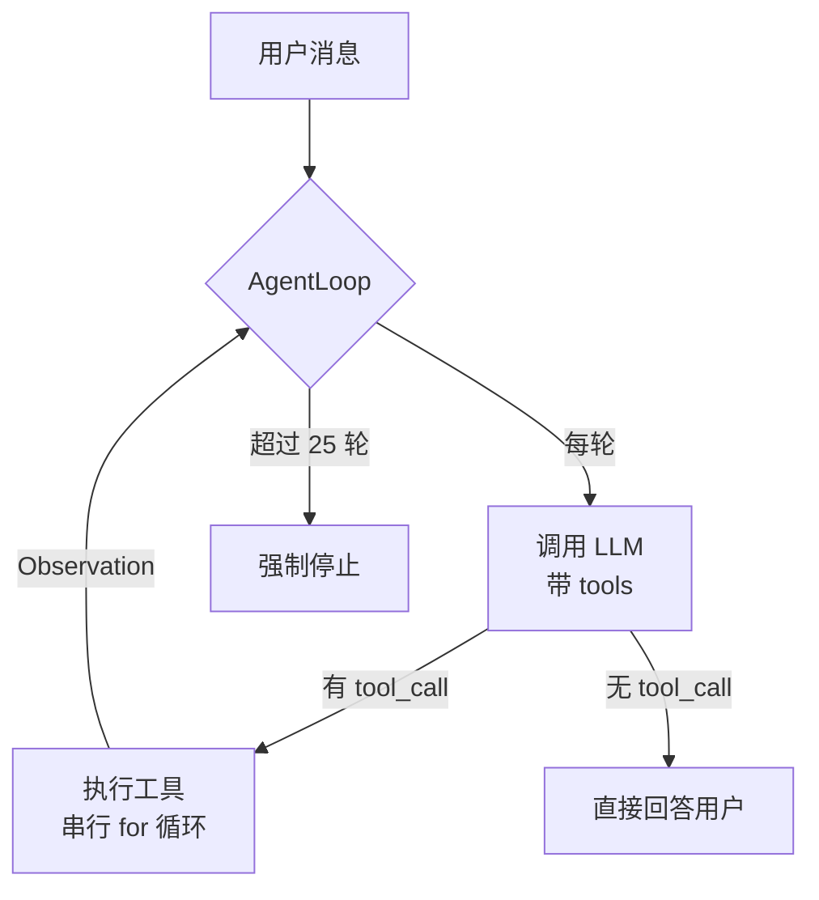

# Agent Loop 深度解析：ReAct 循环的工程实现

> 源码：[backend/modules/agent/loop.py](backend/modules/agent/loop.py) (~730 行)
> 难度：⭐⭐⭐ 核心，必须精读
> 预计学习时间：2-3 天

---

## 🎯 一句话定义

**AgentLoop 把 LLM 的「推理」和工具系统的「执行」连成一个可自我纠错的循环——它反复调用 LLM，直到 LLM 认为任务完成。**

## ✅ TL;DR

- 循环 = 「LLM 决策 → 调工具 or 直接回答 → 把结果喂回 LLM」反复
- 默认最多 **25 轮**，单轮内工具**串行**执行（`loop.py:400`）
- 某 Key 失败会**自动换 Key**继续，不中断会话
- 支持**流式输出**和**中途取消**（`/stop`）



---

## 📋 前置知识

读这个模块之前，确保你理解：
- Python `async/await`、`AsyncIterator`、`asyncio`
- LLM Function Calling / Tool Use 的基本概念（[00-prerequisites.md](00-prerequisites.md) 第 1.3 节）
- ReAct 模式的理论（Thought → Action → Observation → Thought...）
- 什么是流式输出（Streaming）、Token、Context Window

---

## 🎯 核心概念

### 这个模块解决什么问题？

`AgentLoop` 是 CountBot 的**心脏**。它把 LLM 的「推理能力」和工具系统的「执行能力」连接成一个**可自我纠错的循环**。

**一句话**：AgentLoop 做的是「不断调用 LLM，直到 LLM 不再需要调工具了」。

### 核心设计

```
while 迭代次数 < 最大限制:
    ① 构建消息列表（system prompt + 历史 + 当前消息）
    ② 流式调用 LLM（带工具定义）
    ③ 收集 LLM 回复的文本内容和 tool_call
    ④ 如果 LLM 返回了 tool_call:
        → 去重（防止 API 偶发重复）
        → 逐个执行工具（带重试）
        → 结果追加回消息列表
        → 回到步骤 ②（让 LLM 看到结果后继续推理）
    ⑤ 如果 LLM 只返回文本、没有 tool_call:
        → 任务完成，结束循环
```

### 关键设计点一览

| 特性 | 实现 | 为什么重要 |
|------|------|-----------|
| **流式输出** | `AsyncIterator[StreamChunk]` | 用户体验：逐字显示 |
| **工具去重** | 按 `tool_call.id` 去重 | Anthropic API 偶发重复 tool_call |
| **Key 轮换** | 401/429 错误自动换 Key，最多 3 次 | 生产高可用 |
| **取消令牌** | `CancellationToken` | 用户可随时 /stop |
| **批次截断** | 工具调用数超限时截断 | 防止无限循环烧 Token |
| **运行态 Provider 切换** | `model_override` 动态创建新 Provider | 多租户/多模型场景 |
| **推理内容通知** | `reasoning_event_handler` | 支持 o1/R1 等推理模型 |

---

## 🔍 关键代码路径

### 入口：`process_message()` [line 178]

```python
async def process_message(
    self,
    message: str,             # 用户当前消息
    session_id: str,          # 会话 ID
    context: List[Dict],      # 历史消息
    session_summary: str,     # 对话摘要
    cancel_token,             # 取消令牌
    model_override: Dict,     # 每会话模型覆盖
    tool_event_handler,       # 工具事件回调（推送到前端）
    ...
) -> AsyncIterator[str]:     # 流式返回给用户
```

**从这里传入的 `context` 是什么？** — 历史消息列表（由 `ContextBuilder.build_messages()` 构建），已包含 system prompt 作为第一条消息。

### 路径 1：模型解析 [line 80-176] — `_resolve_execution_runtime()`

这是**第一个值得深挖的地方**。它决定了「这条消息用哪个模型、什么参数」。

关键逻辑：
```python
# 如果没有 model_override → 用 AgentLoop 初始化时的默认值
if not model_override:
    return (base_provider, base_model, ...)

# 如果有 model_override → 提取覆盖值
candidate_model = model_override.get("model", base_model)
candidate_temperature = model_override.get("temperature", base_temperature)
...

# 如果 model_override 指定了不同的 provider/api_key/api_base
# → 运行时动态创建新的 Provider 实例！
if override_provider or override_api_key or override_api_base:
    candidate_provider = create_provider(
        api_key=runtime_state.api_key,
        api_base=runtime_state.api_base,
        ...
    )
```

**为什么这很厉害**：不是简单换 model 名字，而是**完整重建 Provider 实例**——不同的 API Key、不同的 API Base URL、不同的 api_mode。这使得：
- 团队 A 可以用 DeepSeek，团队 B 可以用 Claude
- 一个部署实例同时服务多个模型提供商
- 单条消息可以指定完全不同的 provider

### 路径 2：核心循环 [line 255-613]

```
while iteration < runtime_max_iterations:    # 默认 25 次
    iteration += 1

    ① 检查取消令牌
    ② 获取工具定义 → tools.get_definitions()
    ③ 流式调用 LLM → active_provider.chat_stream(...)
       ├── chunk.is_content     → 文本内容 → yield 给用户
       ├── chunk.is_tool_call   → 工具调用 → 收集到 buffer
       ├── chunk.is_reasoning   → 推理内容 → reasoning_event_handler
       ├── chunk.is_error       → 错误 → 尝试 Key 轮换
       └── chunk.is_done        → 结束原因

    ④ 如果没有 tool_call → break（任务完成）

    ⑤ 去重工具调用（按 tool_call.id）
    ⑥ 检查剩余工具调用额度，必要时截断

    ⑦ 将 assistant 消息（含 tool_calls）追加到 messages

    ⑧ 逐个执行工具:
        ├── 通知前端 "开始执行"
        ├── self.execute_tool(name, args)  ← 带重试
        ├── 记录到审计日志
        ├── 追加 tool result 到 messages
        └── 通知前端 "执行完成"

    ⑨ 回到循环开头
```

### 路径 3：Key 轮换 [line 657-727] — `_try_key_rotation()`

```python
def _try_key_rotation(self, current_provider, error_text):
    # 1. 判断错误是否可轮换（401/429/配额等）
    if not _is_key_rotation_eligible_error(error_text):
        return None

    # 2. 检查轮换次数限制（最多 3 次）
    if self._key_rotation_count >= self.MAX_KEY_ROTATION_RETRIES:
        return None

    # 3. 获取 KeyRotator，标记当前 key 失败
    rotator = get_key_rotator(provider_id, api_keys)
    next_key = rotator.mark_key_failed(current_key)

    # 4. 用新 key 创建新 Provider
    new_provider = create_provider(api_key=next_key, ...)
    return new_provider
```

**细节**：轮换成功后，`iteration -= 1` 使当前轮次不计数——对用户透明。

### 路径 4：工具执行 [line 729-759] — `execute_tool()`

```python
async def execute_tool(self, tool_name, arguments):
    for attempt in range(self.max_retries):    # 默认 3 次
        try:
            result = await self.tools.execute(tool_name, arguments)
            break
        except Exception as e:
            if attempt < self.max_retries - 1:
                await asyncio.sleep(self.retry_delay)  # 默认 1 秒
    return result
```

---

## 💡 可深挖的逻辑

### 深度点 1：`_resolve_execution_runtime()` 的设计权衡

**问题**：为什么不在 AgentLoop 初始化时就确定 provider，而是每次 `process_message()` 调用时重新解析？

**答案**：
- 配置可能热更新（用户在前端改了 model 设置）
- 同一条消息可能指定不同的 provider（通过 model_override）
- 不同会话可能共享同一个 AgentLoop 实例（虽然当前版本没有这样做）

**延伸思考**：如果让你设计，你会把 provider 选择放在哪一层？AgentLoop 层、Session 层、还是 Request 层？各有什么优劣？

### 深度点 2：为什么工具去重有两层？

第一层在 `loop.py:332-343`（按 tool_call.id 去重），第二层在 `subagent.py:438-448`（按 name+arguments signature 去重）。

**原因**：
- 按 id 去重：处理 API 层面的重复（同一个 tool_call 被返回两次）
- 按 signature 去重：处理 LLM 层面的重复（LLM 两次决定调用同样的工具和参数）

### 深度点 3：`prefer_direct_workflow_result` 参数 [line 515-520]

```python
if tool_name == "workflow_run" and prefer_direct_workflow_result:
    final_content = result
    direct_result_selected = True
    if result:
        yield result
    break
```

**作用**：当用户通过 `@team_name` 调用 Agent 团队时，直接返回 Workflow 的结果，不经过 LLM 二次总结。这是一个**减少不必要 LLM 调用的优化**——因为 Workflow 输出已经是完整的分析结果了，再让 LLM 总结一遍反而可能丢失细节。

### 深度点 4：工具调用批次截断 [line 353-366]

```python
remaining_tool_slots = runtime_max_iterations - total_tool_calls
if len(tool_calls_buffer) > remaining_tool_slots:
    tool_calls_buffer = tool_calls_buffer[:remaining_tool_slots]
```

**为什么需要截断**：LLM 可能在一轮中返回 10 个 tool_call，但如果只剩 3 个 tool_call 额度，必须截断——否则会产生「有 tool_call 没 tool_result」的不配对消息，LLM API 会拒绝请求。

---

## 🔧 技术选型分析：为什么 AgentLoop 这样设计（Why）

### 决策 1：为什么选 ReAct，而不是 Reflexion / ToT / GoT？
ReAct（Thought → Action → Observation）是"单链推理 + 行动"的最简范式，覆盖了 80% 的 Agent 任务（读文件、跑命令、查资料再回答）。Reflexion（自我反思重试）、ToT（树状搜索）、GoT（图状推理）解决的是"需要回溯 / 探索多路径"的难题，但代价是指数级 token 和延迟。CountBot **当前只实现 ReAct**——这是有意的取舍：先保证确定、可控、可解释，把"探索式推理"留给后续按需扩展（这也是面试中常被追问的诚实短板，见 Q93）。关键是理解：ReAct 不是"能力最全"的范式，而是"性价比最高、最易落地"的范式。

### 决策 2：为什么主循环里工具是串行执行的（loop.py:400 `for tool_call in tool_calls_buffer`）？
串行有三个现实理由：① **依赖顺序**——后续工具常依赖前置工具的输出（先 `read_file` 拿到路径，再 `write_file`）；② **预算简单**——`total_tool_calls` 与 `iteration` 共用 `runtime_max_iterations`，串行让"思考轮次"和"动手次数"互相制约，模型最易推理与防失控；③ **实现与调试成本最低**。代价是：当 LLM 一轮返回多个**无依赖**工具时无法并发省时——这是已知的优化点（面试 Q89），不是缺陷，是可插拔的增强。

### 决策 3：为什么 Key 轮换放在 Loop 层而不是 Provider 层？
Provider 实例被设计成"无状态、单次请求"（见 02 篇：`OpenAIProvider` 的 `max_retries=0`，重试交给上层）。密钥故障转移需要"对用户透明、不计入迭代、可跨请求累计失败次数"的语义，这天然属于**编排层（Loop）**的职责。把重试策略上移，Provider 才能保持纯粹、可复用、易测试。

### 决策 4：为什么默认 25 轮迭代，且"思考轮次"和"工具调用次数"共用一个上限？
这是成本与能力的平衡线：太低（如 3）会截断多步任务，太高会放任 LLM 空转烧 token。共用上限让两者互相制约——避免 LLM 用很多轮空想而不行动，也避免疯狂调工具不总结。经验值 25 覆盖了绝大多数真实任务，又给失控留了天花板。

### 决策 5：为什么模型解析（`_resolve_execution_runtime`）放在每次 `process_message` 调用时，而非初始化时？
为了支持两个真实需求：① 用户在 UI 改模型设置后**热生效**，无需重启；② 单条消息可经 `model_override` 指定**完全不同的 provider / key / base_url**（多租户、私有化部署）。把解析推迟到请求层，AgentLoop 实例才能被多个会话 / 请求安全复用，而不是"一个实例绑定一个模型"。

### 决策 6：为什么流式输出 + 取消令牌是标配？
Agent 多步执行可能耗时数十秒，逐字返回（streaming）是用户体验底线；而"随时 `/stop`"的 `CancellationToken` 是高可用服务的责任——用户有权中断一个跑偏的任务，而不是干等或重启进程。两者共同构成了"可控的长任务体验"。

---

## 🛠️ 落地实施路径：怎么做（How）

### 路径 A：实现并行工具调用（补 Q89 短板）
当前 `loop.py:400` 是 `for tool_call in tool_calls_buffer` 串行。改造路径：
1. 在 `process_message` 参数加 `parallel_tool_calls: bool`（默认 `False`，保持行为兼容）。
2. 当 LLM 返回多个 `tool_call` 且启用并行时，把串行 for 改为 `await asyncio.gather(*[self.execute_tool(...) for ...])`；**必须保留结果的 `tool_call.id` 配对**，因为 OpenAI / Anthropic 要求 `tool` 角色消息按 `assistant` 的 `tool_calls` 顺序对应。
3. 预算记账改为"并发计入"：把 `total_tool_calls += 1` 提到 `gather` 之前一次性加 N，而不是循环内逐个加。
4. **风险点**：并行工具若共享 / 写入同一文件会产生竞态。建议只对"纯读取、无副作用"的工具开并行——可在 `Tool` 基类加 `side_effect_free: bool` 标记（如 `read_file`=True，`write_file`/`exec`=False），Loop 据此决定是否并行。
5. **验证**：构造"同时读 3 个文件"的任务，观察耗时是否从 3× 降为 1×，且消息配对错乱报错为零。

### 路径 B：给循环加一个新的"护栏"
例如加"单工具超时"：在 `execute_tool` 外包一层 `asyncio.wait_for(..., timeout=self.tool_timeout)`，超时返回**结构化错误字符串**（而非抛异常），让 LLM 自行改策略。注意复用现有的"返回错误字符串而非抛异常"约定（见 03 篇工具执行约定），保持 Agent 自我修复链路不断。

### 路径 C：调参与可观测性
- 改 `max_iterations`：在配置层暴露，先改 3 观察"任务被截断"的现象（练习 3），再据真实任务分布定合理值。
- 加 `trace_id` 透传：`loop.py` 已有 `trace_id`，可在每次 `execute_tool` 前后 emit 结构化日志（JSON），方便生产按会话追踪"哪一轮、调了什么、花了多久"。

### 路径 D：验证你的改动（回归测试）
任何对循环逻辑的修改，都必须跑通三个场景并沉淀为 `tests/` 下的回归用例：① 正常多步任务；② 触发 Key 轮换的失败注入（用假 key）；③ 中途取消（`/stop`）。这防止后续改动悄悄破坏循环不变量。

---

## 🎤 面试话术

### 2 分钟版：「Agent Loop 是怎么工作的」

> CountBot 的 Agent 核心是一个 ReAct 循环。每条用户消息进来后，进入一个 while 循环。
>
> 每轮迭代，先把历史消息和工具定义发给 LLM。LLM 可能返回两样东西：文本内容和工具调用指令。
>
> 如果是文本，直接流式推给用户。如果 LLM 决定要调用工具——比如读取文件或执行命令——我们就执行这个工具，然后把结果追加回对话历史里，开始下一轮迭代。LLM 看到工具结果后继续推理，可能会再调别的工具，也可能生成最终回复。
>
> 这个循环有几个生产级细节：API Key 轮换（遇到 401/429 自动切 key 重试）、工具去重（API 偶尔返回重复 tool_call）、取消令牌（用户可以随时中断）、以及批次截断（防止单轮工具调用数超限导致 API 报错）。
>
> 默认最多 25 轮迭代，但大部分对话 2-3 轮就结束了。

---

## ✏️ 练习建议

### 练习 1：画流程图（30 分钟）
不看代码，画出 `process_message()` 的完整流程图，包含：
- 正常路径（有 tool_call → 执行 → 继续）
- 异常路径（Key 轮换、工具失败、取消）
- 结束路径（无 tool_call、达到上限）

然后对照源码检查遗漏。

### 练习 2：加日志观察（1 小时）
在 `loop.py` 的 `process_message()` 中加入自定义日志，启动项目并发起一次对话，观察：
- 每轮迭代 LLM 的输入消息条数
- 每次工具调用的名称和参数
- Key 轮换是否触发过

### 练习 3：修改最大迭代次数（15 分钟）
把 `max_iterations` 改成 3，然后发一个需要 4+ 步才能完成的任务，观察 Agent 的行为变化。

### 练习 4：追踪取消流程（30 分钟）
发送一条复杂任务（如「分析项目所有 Python 文件」），在 Agent 执行过程中点击 `/stop`，追踪代码中取消令牌从设置到生效的完整路径。

---

## 🔭 已知限制（诚实短板 · 对应面经题）

- **⚠️ 主循环工具串行（Q89）**：单轮内多个 `tool_call` 是 `for` 循环串行执行（`loop.py:400`），无并行。若工具间无依赖，会拖慢延迟。→ 补法见本文「落地实施路径」的「并行工具调用」小节。
- **⚠️ 仅 ReAct 单一范式（Q93）**：内置只有 ReAct，没有 ToT/GoT/Reflexion 等树状/反思式搜索。复杂推理任务的上限受限于线性思维链。→ 进阶在 `04` Workflow 讨论。
- **设计取舍非缺陷**：25 轮上限、Key 轮换、每请求解析模型——这些是**有意为之**的护栏，不是短板（详见本文「技术选型分析」）。

---

## 🧭 下一篇该读什么

→ **[05 上下文与记忆](05-context-memory.md)**。核心循环跑起来后，最自然的追问是「长对话的历史怎么管理」——`MemoryStore` 和上下文窗口治理正是答案。

---

## ✅ 自测清单

1. 不看代码，你能口述一次完整的 ReAct 循环吗？（LLM→?→?→回到 LLM）
2. 单轮内 LLM 返回 3 个 tool_call，CountBot 是并行还是串行执行？为什么这样实现？
3. 25 轮上限的作用是什么？到了上限会发生什么？
4. 某个 API Key 失效时，循环如何保证对话不中断？
5. 流式输出（`StreamChunk`）和「工具执行」在循环里是什么关系？
