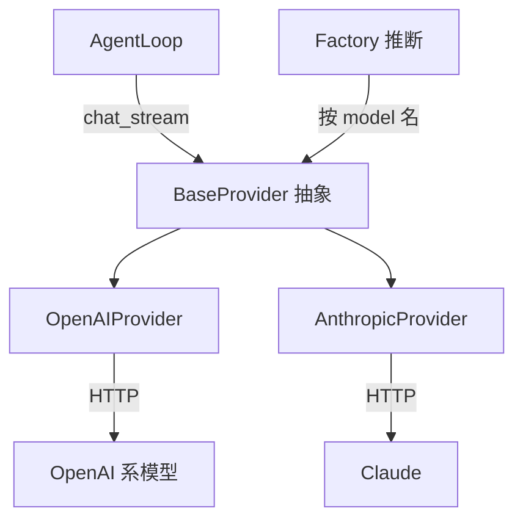

# Provider 层深度解析：LLM API 的统一抽象

> 源码目录：[backend/modules/providers/](backend/modules/providers/)
> 核心文件：`base.py` (50行), `openai_provider.py` (1200行), `factory.py` (96行), `runtime.py` (291行)
> 难度：⭐⭐ 重要，需要理解设计模式
> 预计学习时间：1-2 天

---

## 🎯 一句话定义

**Provider 层用策略模式把几十家 LLM 的 API 统一成同一个 `chat_stream()` 接口，让上层（AgentLoop）完全不关心背后是哪个模型。**

## ✅ TL;DR

- 两种实现：`OpenAIProvider` + `AnthropicProvider`，覆盖主流 OpenAI 系与 Claude
- 上层只调 `chat_stream(messages, tools, model)`，拿到统一的 `StreamChunk`
- `base_url` 可配 → **支持私有化/本地模型**（`openai_provider.py:66` `anthropic_provider.py:464`）
- 某 Key 失败 → 按列表**自动轮换**下一个 Key
- `max_retries=0`：Provider **不**自动重试，重试逻辑在更上层



---

## 📋 前置知识

- 策略模式（Strategy Pattern）和工厂模式（Factory Pattern）
- 什么是 API Key、API Base URL
- LLM 的 Chat Completions API 格式（system/user/assistant/tool 四种角色）
- OpenAI 和 Anthropic 的 API 差异（大致了解即可）

---

## 🎯 核心概念

### 这个模块解决什么问题？

市面上有几十个大模型提供商，每个的 API 格式、认证方式、错误处理都不一样。Provider 层用**策略模式**把它们统一为一个接口，上层代码（AgentLoop）不需要知道底层用的是哪个模型。

### 设计思路

```
         AgentLoop.process_message()
                    │
                    │ 只调用 chat_stream(messages, tools, model, ...)
                    ▼
         ┌──────────────────────┐
         │   LLMProvider (ABC)  │  ← 抽象基类：定义统一接口
         │   async chat_stream( │
         │     messages, tools, │
         │     model, ...       │
         │   ) -> AsyncIterator │
         │        [StreamChunk] │
         └──────┬───────────────┘
                │
       ┌────────┴────────┐
       ▼                 ▼
┌──────────────┐  ┌──────────────┐
│ Anthropic    │  │ OpenAI       │
│ Provider     │  │ Provider     │
│              │  │              │
│ 原生 Messages │  │ OpenAI 兼容  │
│ API          │  │ API          │
│              │  │ → 覆盖 100+  │
│              │  │   提供商      │
└──────────────┘  └──────────────┘
```

**关键抽象**：所有的输出都通过统一的 `StreamChunk` 数据结构传递：

```python
class StreamChunk:
    content: Optional[str]         # 文本内容
    tool_call: Optional[ToolCall]  # 工具调用
    finish_reason: Optional[str]   # 结束原因 (stop/length/tool_calls)
    reasoning_content: Optional[str]  # 思考过程 (推理模型专用)
    error: Optional[str]           # 错误信息
    provider_payload: Optional[Dict]  # Provider 原始 payload（透传用）
```

### Provider 选择逻辑

```
用户/团队指定了 provider_id 吗？
  ├── 是 "anthropic" → AnthropicProvider（原生 Messages API）
  ├── 是 "openai" 或任何 OpenAI 兼容的 → OpenAIProvider
  │   └── 覆盖: DeepSeek, 千问, GLM, Kimi, 豆包, Ollama, OpenRouter...
  └── 没有指定 → 用全局默认 provider
```

**为什么 100+ 提供商只要两个 Provider 类？** — 因为几乎所有国产模型和第三方代理都兼容 OpenAI 的 API 格式。只要把 `api_base` 指向不同 URL，同一个 `OpenAIProvider` 就能服务所有提供商。

---

## 🔍 关键代码路径

### 路径 1：工厂创建 [factory.py:12-96]

```python
def create_provider(api_key, api_base, default_model, provider_id, api_keys, ...):
    # 1. 查注册表获取 provider 元数据
    metadata = get_provider_metadata(provider_id)

    # 2. 收集 API Keys，初始化 KeyRotator
    effective_api_keys = [...]
    if effective_api_keys and provider_id:
        rotator = get_key_rotator(provider_id, effective_api_keys)
        selected_key = rotator.next_key()  # 轮询选一个 key

    # 3. 根据 provider 类型选择实现类
    if metadata.id == "anthropic":
        provider_class = AnthropicProvider
    else:
        provider_class = OpenAIProvider  # 默认

    # 4. 创建实例
    return provider_class(api_key=selected_key, api_base=api_base, ...)
```

**值得注意的细节**：
- 创建时就用 `rotator.next_key()` 选取了一个初始 key（不是等到出错才选）
- 如果配置了多个 API Key，创建时就自动启用轮换

### 路径 2：运行时校验 [runtime.py:152-224]

`get_provider_runtime_state()` 判断一个 provider 是否真正可用：

```python
def get_provider_runtime_state(app_config, provider_id, ...):
    # 判断链：
    exists = 元数据里有没有这个 provider
    enabled = 用户有没有启用
    configured = API Key 配了没有 + API Base 配了没有
    selectable = enabled AND configured
    # 所有条件都满足才能在列表里显示
```

不满足的条件会被翻译为中英双语的可读提示（如 "缺少 API Key / Missing API key"）。

### 路径 3：KeyRotator [runtime.py:69-134]

```python
class KeyRotator:
    """线程安全的 API Key 轮换器"""

    def next_key(self):      # 轮询：取下一个 key
    def current_key(self):   # 查看当前 key（不移动指针）
    def mark_key_failed(self, failed_key):  # 故障转移：标记某 key 失败，跳过它
    def is_auth_error(self, error):   # 判断是否认证错误
    def is_rate_limit_error(self, error):  # 判断是否限流错误
```

**线程安全**：用 `threading.Lock` 保护，因为多个异步协程可能同时轮换 key。

### 路径 4：实际调用 [openai_provider.py:38-80]

```python
async def chat_stream(self, messages, tools, model, ...):
    # 1. 规范化模型名（处理别名等）
    model = self._normalize_model_name(raw_model)

    # 2. 创建 OpenAI 客户端
    client = AsyncOpenAI(
        api_key=self.api_key or "not-needed",
        base_url=self.api_base,
        timeout=self.timeout,
        max_retries=0,  # 我们自己管理重试
    )

    # 3. 流式调用
    async for chunk in self._chat_stream_via_chat_completions(
        client, messages, tools, model, ...
    ):
        yield chunk  # 统一的 StreamChunk
```

**为什么 `max_retries=0`？** — 因为 AgentLoop 层自己管理重试和 Key 轮换，SDK 层的重试只会干扰上层策略。

---

## 💡 可深挖的逻辑

### 深度点 1：`StreamChunk` 的统一设计

为什么需要 `reasoning_content` 和 `provider_payload` 两个看似「多余」的字段？

- **`reasoning_content`**：推理模型（o1, DeepSeek-R1, Claude extended thinking）在输出最终回复前有「思考过程」。有些提供商把它放在不同的字段里（如 Anthropic 的 `thinking` 块），统一到 `reasoning_content` 后上层不用关心差异。
- **`provider_payload`**：有些提供商在 API 响应中放入了额外信息（如 token 用量、安全审核结果），透传这个 payload 可以让上层（ContextBuilder）在构建下一条消息时保持格式兼容。

### 深度点 2：`thinking_profiles.py` 的设计

推理模型的 API 参数与普通模型不同（如 OpenAI o1 不接受 `temperature`，但接受 `reasoning_effort`）。`thinking_profiles.py` 提供了 `apply_reasoning_request_fields()` 和 `clear_reasoning_request_fields()` 两个函数，在调用前动态添加/移除特定参数。

**延伸思考**：随着更多推理模型出现，这种「按模型类型动态调整请求参数」的策略会越来越重要。当前是 if-else 处理，如果扩展到 10+ 种推理模型，你会怎么重构？

### 深度点 3：Provider 元数据的注册表

`registry.py` 中每个 provider 的元数据包含：`id`, `name`, `default_model`, `default_api_base`, `api_mode`, `supports_thinking` 等。这个注册表让工厂方法能自动推断缺失的配置（比如用户没填 api_base，就用注册表中的默认值）。

---

## 🔧 技术选型分析：为什么 Provider 层这样设计（Why）

### 决策 1：为什么两个 Provider 类能覆盖 100+ 厂商？
因为行业事实是：**OpenAI 的 Chat Completions API 已成为事实标准**。国产模型（DeepSeek、千问、GLM、Kimi、豆包）和大量代理（OpenRouter、Ollama、Together）都提供 OpenAI 兼容端点。只要把 `api_base` 指向不同 URL，同一个 `OpenAIProvider` 就能服务它们；只有 Anthropic 因原生 Messages API 差异较大，单独一个类。这是"用抽象换覆盖度"的经典决策——用两个实现类 + 一份注册表，覆盖一个快速膨胀的厂商矩阵，而不是为每个厂商写一套适配。

### 决策 2：为什么抽象成 `StreamChunk` 统一结构，而不是各 Provider 返回各自的原生对象？
上层（`AgentLoop`、`ContextBuilder`）不应关心"这个 `reasoning_content` 来自 Anthropic 的 `thinking` 块还是 DeepSeek 的 `reasoning` 字段"。统一成 `StreamChunk` 后，所有差异被封装在两个实现类内部，上层代码**零改动**即可支持新模型。这正是策略模式的价值：依赖倒置，厂商差异被关进黑盒。

### 决策 3：为什么 `max_retries=0`？
因为重试 / 轮换的策略归属已经在 Loop 层实现（401/429 自动换 key、对用户透明）。SDK 自带的重试会和上层策略打架（重复重试、掩盖故障、打乱预算），所以显式关掉，把控制权完全上收。Provider 变成纯粹的"发一次请求"，可预测、可测试。

### 决策 4：为什么 KeyRotator 用线程锁（`threading.Lock`）而非 asyncio 锁？
因为 API Key 选择可能发生在**同步初始化路径**（`create_provider`）和**异步执行路径**（`_try_key_rotation`）两处。线程锁能覆盖两种上下文；纯 `asyncio.Lock` 在非协程路径用不了。这是一个"为兼容性牺牲一点点优雅"的务实选择——key 选择是低频操作，锁粒度粗无性能问题。

### 决策 5：为什么元数据注册表（`registry.py`）存 `default_api_base` / `supports_thinking` 等？
为了"配置推断"：用户只填 `provider_id`，系统就能从注册表补出默认 base_url、判断是否支持推理模型、决定要不要套用 `thinking_profiles`。把"厂商知识"集中在一处，**新接一个厂商只改注册表、不改逻辑**——这是开闭原则的体现。

### 决策 6：为什么 `thinking_profiles.py` 用"动态增删参数"而不是硬分支？
推理模型（o1、DeepSeek-R1、Claude extended thinking）的请求参数与普通模型不同（如 o1 不接受 `temperature`，需 `reasoning_effort`）。用 `apply_reasoning_request_fields()` / `clear_reasoning_request_fields()` 在调用前动态改 payload，避免 `if model=="o1"` 式硬分支扩散。新增推理模型只加一个 profile，不动调用主路径——可扩展性优先。

---

## 🛠️ 落地实施路径：怎么做（How）

### 路径 A：接入一个新的 OpenAI 兼容厂商（最常见）
1. 打开 `registry.py`，在 providers 列表加一项：`{id:"myllm", name:"MyLLM", default_model:"xxx", default_api_base:"https://api.myllm.com/v1", api_mode:"openai", supports_thinking:false}`。
2. **无需写 Provider 类**——`create_provider` 对非 anthropic 一律走 `OpenAIProvider`。
3. 在 UI / 配置文件启用该 provider，填 API Key。
4. 验证：发一条消息，看日志里 `_normalize_model_name` 是否正确、请求是否打到你的 base_url。

### 路径 B：接入一个"非标准"厂商（需要新 Provider 类）
当某厂商不完全兼容 OpenAI 格式（如自定义鉴权头、特殊流式结构）：
1. 新建 `backend/modules/providers/my_provider.py`，继承 `LLMProvider`，实现 `chat_stream` 返回 `StreamChunk`。
2. 在 `factory.py` 的 `if metadata.id == "anthropic"` 分支后，加 `elif metadata.id == "myllm": provider_class = MyProvider`。
3. 在 `registry.py` 登记。
4. **关键**：务必把厂商特有字段（如 reasoning）映射到 `StreamChunk.reasoning_content` / `provider_payload`，保证上层无感知。

### 路径 C：支持一个新的推理模型（如新出的 o-series）
1. 在 `thinking_profiles.py` 加该模型的请求参数字典（哪些参数要加、哪些要清，如 `temperature` vs `reasoning_effort`）。
2. 在 registry 把它的 `supports_thinking` 置 `True`。
3. 验证 `apply_reasoning_request_fields` / `clear_reasoning_request_fields` 在调用前后正确增删参数——可在 `openai_provider.py` 入口打日志确认最终 payload。

### 路径 D：私有化 / 多租户部署（利用已有能力）
`_resolve_execution_runtime`（`loop.py`）已支持 `api_base` 覆盖：在 `model_override` 里传不同 `api_base`，即可让单条消息打到企业内网模型网关，**无需改任何 Provider 代码**。代码事实：`providers/openai_provider.py:66` 与 `anthropic_provider.py:464` 都有 `client_kwargs["base_url"] = self.api_base`，私有化支持是内建的。

### 路径 E：验证
- 功能：用路径 A 接入一个真实兼容端点，确认对话正常。
- 容错：配置两个无效 key，确认 `KeyRotator` 轮换到第三个仍失败时报错（不静默、不重试爆炸）。
- 推理：用路径 C 的模型发"先思考再答"的问题，确认 `reasoning_content` 被透传到前端。

---

## 🎤 面试话术

### 1 分钟版

> CountBot 的 Provider 层用策略模式统一了 100+ 个 LLM 提供商的 API 差异。核心是一个抽象基类加一个统一的 StreamChunk 数据结构，所有厂商的差异都被封装在两个实现类里——Anthropic 原生 API 和 OpenAI 兼容 API。
>
> 比较有意思的是 API Key 轮换机制：配置多个 Key 后，系统在 401/429 错误时自动切换到下一个 Key 重试，对用户透明。创建 Provider 时就初始化了 KeyRotator，用了线程锁保证并发安全。

---

## ✏️ 练习建议

### 练习 1：追踪一次 LLM 调用（30 分钟）
在 `openai_provider.py` 的 `chat_stream()` 方法入口打日志，发起一次对话，观察：
- 传入的 messages 有几条？
- 工具定义有几个？每个工具的名字是什么？
- 模型名有没有被 `_normalize_model_name` 修改？

### 练习 2：添加一个新的 Provider（1 小时）
在 `registry.py` 的 providers 列表中，添加一个你常用的 LLM 提供商（如 Groq、Together AI 等）。注意它是否兼容 OpenAI API 格式——如果是，不需要写新的 Provider 类，只需添加元数据。

### 练习 3：理解 Key 轮换（30 分钟）
配置两个无效的 API Key（随便写的字符串），发一条消息，观察日志中 Key 轮换的完整过程。

---

## 🔭 已知限制（诚实短板 · 对应面经题）

- **仅 2 个 Provider 实现**：覆盖 OpenAI 系 + Claude 主流，但 Gemini / 国产小众模型需新增类（本文「落地实施路径」已给步骤）。
- **`max_retries=0`**：Provider 层把重试交给上层，若上层未接住，单次失败即报错——这是**有意解耦**，代价是调用方要自己兜底。
- **非 OpenAI 格式厂商**：需写独立 Provider（如 Anthropic 的消息角色映射），无法仅靠 `base_url` 复用。

---

## 🧭 下一篇该读什么

→ **[03 Tool 系统](03-tool-system.md)**。LLM 能「说话」了（Provider），下一步是让它「能做事」——工具系统就是 Agent 的手。

---

## ✅ 自测清单

1. 策略模式在这里解决了什么问题？如果不用它，上层代码会怎样？
2. `chat_stream` 返回的 `StreamChunk` 为什么要统一抽象？
3. 怎么用同一套代码接一个本地私有化模型？（提示：`base_url`）
4. Key 轮换在哪一层触发？Provider 自己会重试吗？
5. 新增一个兼容 OpenAI 格式的厂商，需要写新类吗？
