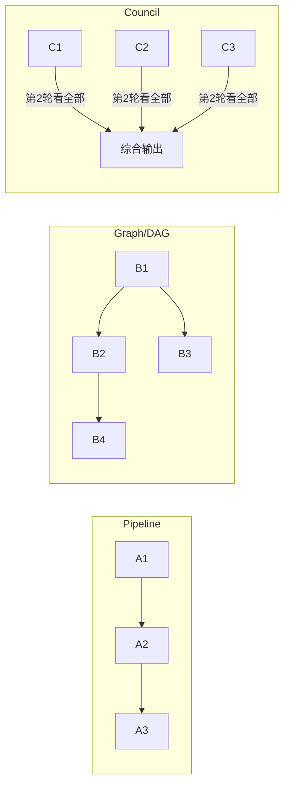

# Workflow 引擎深度解析：多 Agent 编排的三种模式

> 源码：[backend/modules/agent/workflow.py](backend/modules/agent/workflow.py) (~600 行)
> 难度：⭐⭐⭐ 高级，面试最有竞争力的模块
> 预计学习时间：2-3 天

---

## 🎯 一句话定义

**Workflow 引擎让你用「声明式」描述多个 Agent 怎么协作：Pipeline（串行）、Graph（DAG 并行）、Council（多视角会商），无需手写调度。**

## ✅ TL;DR

- 三模式：`PIPELINE`（步骤链）/ `GRAPH`（有依赖的并行）/ `COUNCIL`（先并行多视角，再综合）
- 调度核心是 `asyncio.gather` 并行 + DFS **三色法**检测环（`workflow.py:205 _detect_cycle`）
- `COUNCIL` 跑**两轮**：第 1 轮各 Agent 独立，第 2 轮看全部观点后综合
- 这是「多 Agent 编排」层，单 Agent 的脑子仍是 `01` 的 AgentLoop



---

## 📋 前置知识

- ReAct 循环的基本原理（读完 [01-agent-loop.md](01-agent-loop.md)）
- DAG（有向无环图）的基本概念
- Python `asyncio.gather()` 并行执行
- DFS（深度优先搜索）

---

## 🎯 核心概念

### 这个模块解决什么问题？

单个 Agent 适合简单任务，但复杂任务需要**多个 Agent 分工协作**。WorkflowEngine 提供了三种协作模式，让用户不需要手写调度逻辑，只需定义「谁做什么、依赖谁」。

### 三种模式对比

| 维度 | Pipeline | Graph | Council |
|------|----------|-------|---------|
| **执行方式** | 严格串行 | DAG 并行 | 先并行再并行 |
| **上下文传递** | 前序全部输出 | 仅直接依赖的输出 | 第 1 轮：独立；第 2 轮：看全部 |
| **适用场景** | 有明确步骤的任务 | 有依赖关系的并行任务 | 需要多视角的开放式决策 |
| **调度复杂度** | 低 | 中（拓扑排序 + 并行） | 中（两轮并行） |
| **典型用例** | 分析→设计→实现→审查 | 前后端方案并行做再做集成 | 方案评审（安全/性能/成本视角） |

---

## 🔍 关键代码路径

### 结构：数据模型

```python
class AgentSlot:                    # DAG 中的一个节点
    slot_id: str                    # 唯一标识
    label: str                      # 显示名
    prompt_template: str            # 任务模板
    depends_on: List[str]           # 依赖哪些节点
    condition: Optional[dict]       # 可选：执行条件
    phase: SlotPhase                # WAITING → ACTIVE → DONE / FAILED
    output: Optional[str]           # 执行结果
    skipped: bool                   # 是否因条件不满足被跳过
```

### 路径 1：Pipeline [workflow.py:277-331]

```python
async def run_pipeline(self, goal, stages, enable_skills=False):
    accumulated = ""  # 累积输出

    for idx, stage in enumerate(stages):
        # 构建 prompt：目标 + 当前阶段任务 + 前序阶段输出
        prior_ctx = f"## Outputs from previous stages:\n{accumulated}"
        prompt = f"# Workflow Goal\n{goal}\n# Your Task\n{task}\n{prior_ctx}"

        # 执行当前阶段
        output = await self._invoke_agent(prompt, label=role, ...)

        # 累积输出 → 下一阶段能看到
        accumulated += f"\n### {role}:\n{output}"

    return 汇总所有阶段的输出
```

**关键设计**：每个阶段不仅看到自己的任务描述，还看到**所有前序阶段的完整输出**。这保证了下游知道上游做了什么决定。

### 路径 2：Graph — 拓扑调度 [workflow.py:337-474]

这是三个模式中**技术含量最高**的：

```python
async def run_graph(self, goal, slots, ...):
    # 1. 构建 DAG（插槽 + 依赖图）
    slot_map = {s.id: AgentSlot(...) for s in slots}

    # 2. 环路检测 ← 关键！
    if self._detect_cycle(dep_map):
        return "Error: the dependency graph contains a cycle."

    # 3. 调度循环
    while any(s.phase == WAITING for s in slots):
        # 找到所有「依赖都已满足」的节点
        ready = [s for s in slots
                 if s.phase == WAITING
                 and all(dep.phase == DONE for dep in s.depends_on)]

        # 评估条件跳过
        to_execute = [s for s in ready if self._evaluate_condition(s.condition, ...)]

        # 并行执行所有 ready 节点
        await asyncio.gather(*[_run_slot(s) for s in to_execute])

    return 汇总所有节点的输出
```

**调度策略**：每轮找到所有「依赖已全部完成」的节点，并行执行它们。执行完一批再找下一批。

### 路径 2a：环路检测 [workflow.py:205-222]

```python
def _detect_cycle(self, dep_map):
    visited = set()
    in_stack = set()  # 当前 DFS 路径上的节点

    def _dfs(node):
        visited.add(node)
        in_stack.add(node)
        for parent in dep_map.get(node, []):
            if parent not in visited:
                if _dfs(parent): return True
            elif parent in in_stack:  # 发现反向边 → 有环！
                return True
        in_stack.discard(node)
        return False

    return any(_dfs(n) for n in dep_map if n not in visited)
```

**为什么需要 `in_stack`？** — `visited` 只能判断「访问过没有」，不能判断「是不是当前路径上的」。A→B→C→A 这种环，遍历到 C 时 A 在 `in_stack` 里，但 B→D→C（DAG）中 C 虽然在 `visited` 里但不在 `in_stack` 里。

### 路径 3：Council — 多视角审议 [workflow.py:480-595]

```python
async def run_council(self, question, members, cross_review=True):
    # Round 1: 独立立场陈述（并行）
    round1 = dict(await asyncio.gather(*[_initial(m) for m in members]))

    if not cross_review:
        return 独立模式结果

    # Round 2: 交叉评审（并行）
    # 每个成员看到：自己的初始立场 + 所有其他人的立场
    async def _cross_review(member):
        others = "\n\n".join(f"{perspective}:\n{position}"
                            for oid, position in round1.items() if oid != mid)
        prompt = f"Your initial position:\n{round1[mid]}\n\n"
                 f"Others' positions:\n{others}\n\n"
                 f"Refine or defend your position."
        return await self._invoke_agent(prompt, ...)

    round2 = dict(await asyncio.gather(*[_cross_review(m) for m in members]))

    return 汇总两轮结果
```

**关键设计**：第 2 轮每个成员能看到**所有其他人的第 1 轮观点**，然后修正/辩护自己的立场。这模拟了真实的「会议讨论」过程。

---

## 💡 可深挖的逻辑

### 深度点 1：Graph 调度的效率分析

当前的调度策略是「每轮找到所有就绪节点，并行执行，等全部完成再找下一批」。这意味着：如果 A(30s) 和 B(10s) 并行执行，调度器必须等 A 也完成（30s）才能启动依赖 B 的节点 C——即使 C 完全不依赖 A。

**延伸思考**：如果改成「B 完成后立即启动 C，不等 A」的事件驱动调度，代码复杂度会增加多少？是否值得？

### 深度点 2：条件执行 [workflow.py:224-243]

```python
def _evaluate_condition(self, condition, slot_map):
    # 支持的判断类型：
    # - output_contains: 依赖节点的输出中是否包含某文本
    # - output_not_contains: 依赖节点的输出中是否不包含某文本
```

**实际用例**：「先做安全检查，如果发现问题 → 启动修复 agent；如果没发现问题 → 跳过修复 agent 直接完成。」

### 深度点 3：`_invoke_agent()` 中的事件回调 [workflow.py:110-203]

```python
async def _invoke_agent(self, prompt, label, ...):
    task_id = self._mgr.create_task(label, message=prompt, ...)

    # 注册事件回调 → WebSocket 实时推送
    async def _tool_event(event, tool_name, data):
        if event == "tool_call":
            await self._emit_ws("workflow_agent_tool_call", ...)
        elif event == "tool_result":
            await self._emit_ws("workflow_agent_tool_result", ...)
        elif event == "chunk":
            await self._emit_ws("workflow_agent_chunk", ...)

    await self._mgr.execute_task(task_id)
    # ... 等待完成
```

**为什么这是亮点**：用户可以在前端**实时看到**每个 Agent 在做什么——Agent A 正在读文件、Agent B 正在执行命令、Agent C 刚完成了。不是等所有 Agent 跑完才出结果。

### 深度点 4：`_looks_like_embedded_system_prompt` [workflow.py:255-271]

```python
def _looks_like_embedded_system_prompt(text):
    """检测旧版团队配置中把 system prompt 塞在 task 字段里的情况"""
    # 判断 text 是否看起来更像 system prompt 而非 task 描述
    # 如果是 → 自动把 text 当作 system prompt，生成简化的 task
```

这是一个**向后兼容的 hack**。旧版本可能把大段 prompt 放在 task 字段，新版本支持独立的 system_prompt 字段。这个检测避免了旧配置在新版本上行为异常。

---

## 🔧 技术选型分析：为什么 Workflow 这样设计（Why）

### 决策 1：为什么提供三种模式，而不是一种"万能编排"？
`Pipeline` / `Graph` / `Council` 对应三种本质不同的协作拓扑：线性依赖、DAG 依赖、民主审议。强行用一种表达三种，要么表达力不足（`Pipeline` 表达不了并行），要么过度复杂（用 `Graph` 描述串行很啰嗦）。三类各司其职，用户按任务形状选，心智成本低。这比"一个通用 DAG 引擎 + 一堆配置开关"更易用、更易调试。

### 决策 2：为什么 Graph 用"每轮找就绪节点并行"，而不做事件驱动细粒度调度？
当前调度是"批处理式"：每轮收集所有依赖已满足的节点，`asyncio.gather` 一起跑，等整批完成再下一轮。简单、可预测、易调试。事件驱动（B 完成立刻启 C 不等 A）能省一点墙钟时间，但要维护"完成事件 → 唤醒依赖者"的回调网，复杂度陡增。对于 Agent 任务（瓶颈通常在对 LLM 的调用而非调度），批处理足够，不值得为边际收益付复杂度债。

### 决策 3：为什么用 DFS 三色标记做环检测，而不是拓扑排序时顺带发现？
环检测和拓扑排序是两件事。拓扑排序（Kahn 算法）也能发现环，但它需要入度表且对"发现环"的语义不如 DFS 清晰。DFS 三色（`visited` + `in_stack`）能**精确定位"哪些节点构成环"**，报错信息更友好（`workflow.py:205`）。这也是面试深度点 1 已展开的 `in_stack` 必要性——`visited` 只能判"访问过"，`in_stack` 才能判"是不是当前路径上的"。

### 决策 4：为什么 Council 要两轮，且第二轮看所有人观点？
单轮独立输出 = 多个专家各写各的，没有交锋。第二轮"看完全部观点再修正 / 辩护"，模拟真实评审会的信息收敛——这是 Reflexion 式"他人反馈促进自我改进"的轻量版。实践中这一步常显著提升结论质量，尤其开放式决策（选型、方案权衡）。`cross_review=False` 时退化为纯独立输出，保留灵活性。

### 决策 5：为什么 `_invoke_agent` 要实时推送每个子 Agent 的工具事件？
长任务（多 Agent 跑几分钟）若只在最后出结果，用户体验极差且像"卡死"。WebSocket 实时推送让前端展示"Agent A 在读文件、B 在执行"，把黑盒变白盒，也方便用户在中途判断是否 `/stop`。这是"可观测性即体验"的体现。

### 决策 6：为什么 `SpawnTool` 把子 Agent 跑在**同一个 `session_id`**（共享状态）？
`spawn.py:108-118` 让子 Agent 与主 Agent 共享会话上下文与 `MemoryStore`，子 Agent 结果以纯文本回填（`spawn.py:144-145`）。好处是实现简单、天然共享记忆；代价是**上下文污染风险**——子 Agent 的中间产物会混进主上下文（这正是 Q59 不可信内容隔离缺口的来源）。这是一个明确的"简单优先、已知债"的取舍。

---

## 🛠️ 落地实施路径：怎么做（How）

### 路径 A：新增一种编排模式（如 Map-Reduce）
1. 在 `WorkflowMode` 枚举加 `MAP_REDUCE`。
2. 实现 `run_map_reduce(goal, items, map_prompt, reduce_prompt)`：`asyncio.gather` 对每个 item 跑 map，再跑一次 reduce 汇总。
3. 复用现有 `_invoke_agent` 拿到实时推送与事件回调。
4. 在 UI 团队配置里加该模式选项。验证：用"对 10 个文件分别总结再汇总"测试。

### 路径 B：把"串行主循环"升级为"Workflow 内并行工具"（联动 Q89）
在 `_invoke_agent` 内部，若底层 AgentLoop 支持并行工具（见 01 篇路径 A），Workflow 节点的执行自然变快——这是**模块正交带来的免费收益**：改一处，多 Agent 全受益。验证：对比开启前后一个多工具节点的耗时。

### 路径 C：实现跨 Agent 幻觉验证（补 Q95 短板）
当前 Council 第二轮是"各自修正"，没有强制校验彼此事实。增强路径：在 `run_council` 后加一个 `verify_stage`——让一个"校验 Agent"拿到所有成员结论，用 tool（如 `web_fetch`、`read_file`）交叉验证关键事实，输出"哪些结论缺乏依据"。这把"民主"升级为"**可问责的民主**"。落地步骤：
1. 在 `WorkflowEngine` 加 `run_council_with_verification()`。
2. 用 `SpawnTool` 或 `_invoke_agent` 起一个 verification agent，prompt 要求其只输出"结论 → 依据 → 可信度"。
3. 把低可信度结论回灌给成员做第三轮修正。
4. 验证：构造一个含事实错误的成员结论，确认 verify_stage 能标出并触发修正。

### 路径 D：实现 ToT / GoT 式探索（补 Q93 短板，进阶）
在 `Pipeline` 的单节点内引入"生成多候选 → 自评打分 → 择优"：把 `prompt_template` 改为"请生成 3 个方案并自评"，节点输出取最高分。这是把 ReAct 单链升级为树 / 图搜索的最小侵入改造，适合"方案探索"类任务。注意：只在"探索收益 > token 成本"的场景启用（如架构设计、复杂排障），默认仍走 ReAct。

### 路径 E：验证编排改动
- **Pipeline**：跑「分析 → 建议 → 评估」三阶段，确认上下文正确透传。
- **Graph**：故意造环，确认 `_detect_cycle` 报错且点名环上节点。
- **Council**：3 人评审，确认第二轮 prompt 含他人观点，且最终聚合所有视角。
- **Council+验证**：注入一个事实错误，确认 verify_stage 拦截。

---

## 🎤 面试话术

### 3 分钟版（推荐在面试中展开讲）

> CountBot 最让我有成就感的部分是多 Agent 编排引擎。实现了三种协作模式——Pipeline、Graph、Council。
>
> Pipeline 是最简单的串行模式，每个阶段拿到前面所有阶段的输出作为上下文，适合有明确步骤的任务。
>
> Graph 模式基于 DAG 依赖调度。我会先用 DFS 检测用户定义的依赖图有没有环路——用经典的「三色标记法」，一个 visited 集合加一个 in_stack 集合。没问题的话，每轮找到所有依赖已满足的节点并行执行。失败会传播——上游 agent 失败，依赖它的下游会自动标记为 blocked。
>
> Council 模式模拟了人类会议讨论的过程。第一轮所有成员从各自视角独立分析问题，第二轮每个人能看到所有其他人的观点后修正自己的立场。不需要交叉评审的场景也可以关闭，只做独立输出。
>
> 还有一个细节是实时推送——每个子 agent 的工具调用和中间结果都通过 WebSocket 推送到前端，用户能看到团队在做什么，不是等好几分钟才出结果。

---

## ✏️ 练习建议

### 练习 1：手写一个 Pipeline（30 分钟）
在 Web UI 中创建一个 Pipeline 团队：
- 阶段 1：分析项目结构
- 阶段 2：根据分析结果提出改进建议
- 阶段 3：对建议进行可行性评估

观察每个阶段的输出如何传递到下一阶段。

### 练习 2：手动构造一个环路（15 分钟）
创建一个 Graph 团队，故意让 A 依赖 B、B 依赖 C、C 依赖 A。观察 `_detect_cycle()` 的报错信息。

### 练习 3：追踪一次 Council（1 小时）
创建一个 3 人 Council 团队，发送一个复杂问题（如「这个项目应该用 MongoDB 还是 PostgreSQL？」），在代码中加日志，追踪：
1. 第 1 轮三个 Agent 是否并行执行
2. 第 2 轮每个 Agent 的 prompt 中是否包含了其他人的第 1 轮观点
3. 最终输出是否包含所有视角

### 练习 4：对比三种模式（思考题）
对于同一个任务「帮我设计一个用户认证系统」，分别用 Pipeline、Graph、Council 三种模式，分析各自产出有什么不同。

---

## 🔭 已知限制（诚实短板 · 对应面经题）

- **⚠️ 跨 Agent 幻觉验证缺失（Q95）**：Council 多视角能互相补充，但**没有**一个「验证者 Agent」去交叉核对事实一致性，幻觉可能被多个 Agent 共同放大。
- **⚠️ 无 ToT/GoT（Q93 进阶）**：只支持线性 ReAct + 多 Agent 编排，没有树状/图状思维（ToT）或反思（Reflexion）搜索。
- **Council 固定两轮**：轮数写死，无法按任务复杂度自适应增减。

---

## 🧭 下一篇该读什么

→ **[06 MCP 客户端](06-mcp-client.md)**。编排好了多个 Agent，接下来想给它们接「外部世界的工具」（数据库、SaaS、私有 API）——MCP 是标准协议。

---

## ✅ 自测清单

1. Pipeline / Graph / Council 各自的适用场景是什么？能不能互换？
2. 为什么 Graph 模式需要先做**环检测**？不检测会怎样？
3. Council 的两轮分别解决什么问题？
4. 多 Agent 会商一定能减少幻觉吗？什么情况下反而放大？（提示：Q95）
5. 单 Agent 的「脑子」在 Workflow 里由谁提供？
