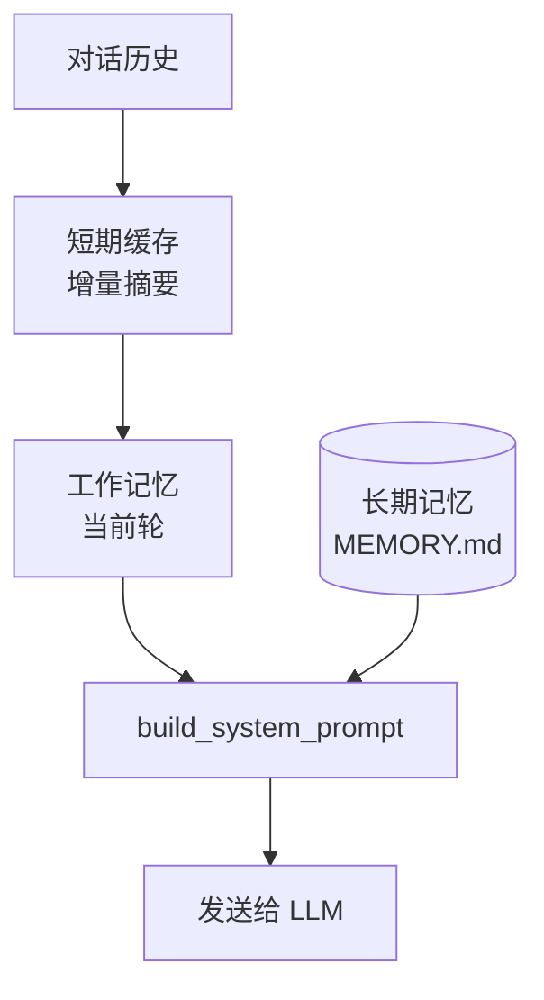

# 上下文与记忆管理深度解析：三层信息架构

> 源码：[backend/modules/session/context_service.py](backend/modules/session/context_service.py) (~660行) + [backend/modules/agent/memory.py](backend/modules/agent/memory.py) (~240行) + [backend/modules/agent/context.py](backend/modules/agent/context.py) (~770行)
> 难度：⭐⭐⭐ 工程深度高，需要理解缓存策略和异步并发
> 预计学习时间：2 天

---

## 🎯 一句话定义

**上下文与记忆解决「LLM 窗口有限，但对话很长」的矛盾：用三层架构（短期摘要 / 工作记忆 / 长期记忆）动态拼装每次发给 LLM 的内容。**

## ✅ TL;DR

- 三层：**短期缓存**（超窗历史压成摘要）/ **工作记忆**（当前轮上下文）/ **长期记忆**（`MEMORY.md` 持久化）
- 短期摘要**增量维护**：只处理新增消息，不重算已有部分
- `MemoryStore` 是**行式**存储 + **关键词**检索（`memory.py:24/116`），无冷启动、无 BM25
- 上下文在**每次请求动态拼装**，不一次性塞满



---

## 📋 前置知识

- LLM 的 Context Window（上下文窗口）概念
- 缓存策略：增量更新 vs 全量重建
- Python `asyncio.Task`、`AsyncSession`
- 读完 [01-agent-loop.md](01-agent-loop.md)（了解 AgentLoop 怎么使用上下文）

---

## 🎯 核心概念

### 这个模块解决什么问题？

LLM 的上下文窗口有限（比如 128K tokens），但对话历史可能很长。你不能把 3 小时前的聊天记录全塞进去——太贵、太慢、而且 LLM 容易在长上下文中「迷失」。

CountBot 用三层架构解决：

```
第 1 层：短期缓存（Short Context Summary）
    │ 作用：把超出窗口的历史消息压缩成一个摘要，作为 system 消息注入
    │ 特点：增量维护 —— 只处理新增的消息，不重算已有部分
    │ 触发时机：历史消息数 > max_history_messages 时
    │ 存储位置：Session 表的 short_context_summary 字段
    ▼
第 2 层：溢出沉淀（Overflow to Memory）
    │ 作用：把超出窗口的历史总结后写入长期记忆文件
    │ 特点：跳过无意义的闲聊，只保留有价值信息
    │ 触发时机：每次请求后自动检查
    │ 存储位置：workspace/memory/MEMORY.md
    ▼
第 3 层：整会话归档（Auto Summarize to Memory）
    │ 作用：当对话足够长时，整场会话的精华自动归档到长期记忆
    │ 特点：≥30 条消息 或 ≥15000 字符才触发
    │ 存储位置：workspace/memory/MEMORY.md
```

### 两类「记忆」

```
会话记忆（Session Memory）              长期记忆（Long-term Memory）
├── 存在 SQLite 数据库                   ├── 存在文件系统（MEMORY.md）
├── 和会话绑定，切换会话就换              ├── 跨会话，Agent 始终能看到
├── 自动管理（消息持久化）                ├── Agent 主动写入（memory 工具）
└── 三层压缩策略（见上）                 └── 行式格式：日期|来源|内容
```

---

## 🔍 关键代码路径

### 路径 1：请求时的上下文构建 [context_service.py:120-186]

```python
async def build_model_context(self, session_id, max_history_messages, ...):
    session = await self.get_session(session_id)

    # 尝试命中短期摘要缓存
    if (
        enable_short_context_summary
        and session.short_context_summary     # 有缓存
        and session.short_context_summary_msg_id  # 知道覆盖到哪条消息
    ):
        # 命中！用摘要替代历史消息
        tail_messages = await self._load_messages(
            session_id,
            after_message_id=session.short_context_summary_msg_id
        )
        history = [summary_as_system_message] + [tail messages]
        return ConversationModelContext(
            history=history,
            short_summary_used=True,  # 标记：本次用了缓存
        )

    # 未命中：直接加载最近 N 条消息
    recent_messages = await self._load_messages(session_id, limit=max_history_messages)
    return ConversationModelContext(history=recent_messages, ...)
```

**为什么是增量？** — `after_message_id` 是关键。不是每次都把所有历史消息送给 LLM 重新总结。第一次总结 50 条 → 标记 `covered_until_msg_id=50`。下次只需处理消息 #51-#60，和已有摘要做递归合并。

### 路径 2：短期摘要缓存刷新 [context_service.py:188-289]

```python
async def refresh_short_summary_cache(self, ...):
    messages = await self._load_messages(session_id)

    # 消息不够多 → 不需要摘要，清空缓存
    if len(messages) <= max_history_messages:
        return await self._clear_short_summary_cache(...)

    # 分离：prefix（需要压缩的旧消息）+ tail（保留的最近消息）
    prefix_messages = messages[:-max_history_messages]

    # 检查是否可以增量合并
    if session.short_context_summary and ...:
        # 增量模式：只压缩新增的消息，和已有摘要合并
        previous_summary = session.short_context_summary
        delta_messages = [m for m in prefix_messages if m.id > previous_covered_until]
        summary = await self._summarize_short_context(
            ..., previous_summary=previous_summary, messages=delta_messages
        )
    else:
        # 首次生成：压缩所有 prefix 消息
        summary = await self._summarize_short_context(
            ..., previous_summary="", messages=prefix_messages
        )

    # 保存缓存
    session.short_context_summary = summary
    session.short_context_summary_msg_id = prefix_messages[-1].id
    await self.db.commit()
```

**核心优化**：不是每次都调用 LLM 重新总结。大多数请求只新增了几条消息，增量合并只需要 LLM 处理这几条，cost 和 latency 几乎为零。

### 路径 3：溢出历史 → 长期记忆 [context_service.py:291-368]

```python
async def summarize_overflow_to_memory(self, ...):
    messages = await self._load_messages(session_id)
    overflow_messages = messages[:-max_history_messages]  # 超出窗口的

    # 只处理还没总结过的部分
    pending = [m for m in overflow_messages if m.id > session.last_summarized_msg_id]

    # 过滤：只要 user 和 assistant 的消息，跳过 tool 和 system
    to_summarize = [m for m in pending if m.role in {"user", "assistant"}]

    # 消息太少不值得总结
    if len(to_summarize) < 3:
        return False

    # 调用 LLM 总结 → 写入 MEMORY.md
    summary = await provider.chat_stream(prompt=OVERFLOW_SUMMARY_PROMPT)
    if "无需记录" not in summary:  # LLM 的判断：这些内容不值得长期记住
        memory_store.append_entry(source="auto-overflow", content=summary)
```

**关键细节**：LLM 自己判断「值不值得记住」——如果溢出内容只是天气查询、测试消息等，LLM 会返回「无需记录」，系统就不写入长期记忆。

### 路径 4：后台维护任务的合并去重 [context_service.py 末尾]

```python
def schedule_context_maintenance(session_id, ...):
    # 如果已有同 session 的维护任务在运行 → 不创建新的
    # 把新请求存为 pending，当前任务完成后自动处理
    existing_task = _CONTEXT_MAINTENANCE_TASKS.get(session_id)
    if existing_task and not existing_task.done():
        _PENDING_CONTEXT_MAINTENANCE[session_id] = request
        return existing_task  # 返回已有任务，调用方等待它完成

    # 创建新任务
    task = asyncio.create_task(_runner(request))
    _CONTEXT_MAINTENANCE_TASKS[session_id] = task
```

**为什么需要合并**：用户连续快速发消息时，每条消息都触发维护 → 5 条消息触发了 5 个维护任务。合并后只需要跑一次（处理所有累积的新消息）。

### 路径 5：System Prompt 构建 [context.py:93-508]

`build_system_prompt()` 是发给 LLM 的第一条消息（role=system），包含：
1. **核心身份**：AI 的名字、角色、时间、运行环境
2. **性格设定**：从数据库/配置加载
3. **自动加载的技能**：标记为 `auto_load: true` 的技能全文
4. **可用技能摘要**：按需加载的技能列表（不加载全文，减少 token）
5. **激活的 Agent 团队**：从数据库读取，注入到 prompt 中提示 LLM 可以用 @team_name 调用
6. **工具使用规则**：文件操作规则、安全准则等
7. **外部编码代理引导**：根据配置决定是否告诉 LLM「你可以用 Claude Code」

---

## 💡 可深挖的逻辑

### 深度点 1：短期摘要的「递归合并」Prompt

`RECURSIVE_SHORT_CONTEXT_SUMMARY_PROMPT` 的实现（在 `prompts.py` 中）。这个 prompt 需要 LLM 做到：
- 保留已有摘要中的关键信息
- 融入新增消息中的新信息
- 控制在字符限制内

**延伸思考**：如果 LLM 在合并时丢失了已有摘要中的重要信息，怎么办？这是一个经典的「摘要漂移（summary drift）」问题。

### 深度点 2：MemoryStore 的行式 vs 文件式设计

当前 MemoryStore 使用简单的行式文本格式：`日期|来源|内容`。优点是极简、人类可读，缺点是：
- 不支持按类型过滤（用户偏好 vs 项目知识 vs 反馈全混在一起）
- 不支持增量更新（只能删行重写）
- 不支持交叉引用

[architecture-optimization.md](../architecture-optimization.md) 的第 6 条建议就是改进这个设计。

### 深度点 3：消息加载的查询策略

`_load_messages()` 支持两种模式：
- `limit=N`：加载最近 N 条（DESC 排序 + LIMIT + reverse）
- `after_message_id=M`：加载 ID > M 的所有消息（ASC 排序 + WHERE）

两种模式服务于不同的上下文场景：前者用于首次加载，后者用于增量补充。

---

## 🔧 技术选型分析：为什么上下文与记忆这样设计（Why）

### 决策 1：为什么是"三层"，而非"一层全压"或"直接上向量库"？
一层全压（每次都让 LLM 总结全部历史）成本爆炸；直接上向量库 RAG 又引入 embedding 服务和检索噪声，且 **CountBot v0.9 还没这层**（诚实短板，见 Q90 面经与 `interview-digest`）。三层（短期摘要缓存 / 溢出沉淀 / 整会话归档）用纯 LLM 摘要 + 文件存储，**零额外基础设施**，覆盖了"长对话不丢信息"的 90% 需求——这是"先用最轻方案解决大部分问题"的务实选择。

### 决策 2：为什么短期摘要要"增量递归合并"，而非"每次全量重算"？
全量重算：每次请求都把 N 条历史喂给 LLM 重新总结，成本 O(N) 且随对话变长线性恶化。增量：只处理新增的 `delta_messages`（`after_message_id` 定位），和已有摘要递归合并，成本接近 O(1)。这是本模块**最大的成本优化点**，也是为何长对话不会越聊越慢。`RECURSIVE_SHORT_CONTEXT_SUMMARY_PROMPT` 负责"保留旧摘要关键信息 + 融入新信息 + 控长"。

### 决策 3：为什么溢出总结让 LLM 自己判断"值不值得记"？
自动把每条闲聊（"天气如何""在吗"）写进长期记忆，会污染 `MEMORY.md`、稀释真正重要的信息。让 LLM 返回"无需记录"时跳过，等于用一个轻量分类器做"信息价值门控"，保持长期记忆**信噪比**。

### 决策 4：为什么维护任务要合并去重（`_CONTEXT_MAINTENANCE_TASKS`）？
用户连发 5 条消息会触发 5 次维护，但前 4 次的总结结果会被第 5 次覆盖 / 重复。合并成"一次处理所有累积新消息"，既省 LLM 调用，又避免重复摘要导致的内容抖动。这是经典的"请求合并（coalescing）"模式。

### 决策 5：为什么 System Prompt 要动态拼装（技能 / 团队按需加载）？
把全部技能全文塞进 system prompt 会撑爆窗口且浪费 token。按需（`auto_load` 全量、其余只列摘要）加载，是"**能力可见性**"与"token 经济性"的平衡。`build_system_prompt()`（`context.py:93`）正是这个拼装中枢。

### 决策 6：为什么 `MemoryStore` 用行式文本（`日期|来源|内容`）而不是结构化存储？
极简、人类可读、零依赖（就是一个 `.md` 文件）。代价是（见深度点 2 / 下方路径 A）：不支持按类型过滤、不支持增量更新、不支持交叉引用。这是"可读性优先"的取舍——对当前规模够用，但的确是已知改进点。

---

## 🛠️ 落地实施路径：怎么做（How）

### 路径 A：解决 MemoryStore 行式格式的局限（补 Q90 相关短板）
当前 `MEMORY.md` 是 `日期|来源|内容` 纯文本，问题（见深度点 2）：无法按类型过滤、无法增量更新、无交叉引用。改造路径：
1. **引入分区**：把记忆按 `user_preference` / `project_knowledge` / `feedback` 三类分文件（或加 `type` 字段）。
2. **检索增强**：`memory_store.search` 增加 `filter_by_type` 参数，按需检索。
3. **纠错开口**：`memory.py` 已有 `delete_lines` 实现但工具层未开口——在 `MemoryTool` 加 `revise` action 即可（属"能力已在、缺接线"型，性价比高，数十行搞定）。
4. **验证**：写入一条偏好、一条知识，确认检索互不串扰；删除一条后确认行号重排正确。

### 路径 B：实现记忆冷启动（补 Q90 短板）
**冷启动问题**：新会话 / 新用户没有长期记忆，Agent 像"失忆"。路径：
1. 首轮对话后，主动调用一次"偏好抽取" prompt，把用户身份 / 目标 / 技术栈写入 `MEMORY.md`。
2. 在 `build_system_prompt` 里把 `MEMORY.md` 摘要注入（已有机制），让后续会话天然带上下文。
3. 进阶：用少量 few-shot 示例引导抽取格式稳定，避免每次结构漂移。

### 路径 C：引入向量检索 / RAG（进阶，补 embedding 短板）
当纯文本关键词检索（`memory.py:116 search()` 的 OR/AND 匹配）不够用时：
1. 加 embedding 服务（本地 `sentence-transformers` 或云 API），把记忆行向量化存向量库。
2. `MemoryStore.search` 增加语义检索分支（相似度 top-k）。
3. **注意**：这是新增基础设施，需评估部署成本；在 RAG 前先确认"关键词检索的召回率是否真的不够"——很多场景纯摘要 + 关键词已足够。

### 路径 D：监控摘要漂移（summary drift）
递归合并可能逐步丢失旧信息（深度点 1）。缓解：① 定期（如每 20 轮）做一次"全量重算摘要"校准；② 在摘要里保留"不可丢弃的事实"清单（由 LLM 标注 `importance`）；③ 关键事实优先存长期记忆（`MEMORY.md`）而非只留在短期摘要里。

### 路径 E：验证
- 跑 35+ 轮对话，确认溢出归档触发且 `MEMORY.md` 内容有信息量（非"无需记录"刷屏）。
- 改 `max_history_messages` 为小值，确认短期摘要命中、历史条数骤降但对话连贯。
- 读一次完整 system prompt，确认动态拼装符合预期（技能 / 团队 / 工具规则都在）。

---

## 🎤 面试话术

### 2 分钟版

> CountBot 的上下文管理是三层架构。第一层是短期摘要缓存——当对话历史超出窗口限制时，把旧消息压缩成摘要而不是直接截断。关键优化是增量维护——不是每次请求都重算，而是只处理新增的消息然后和已有摘要递归合并，大部分请求的 LLM 调用开销接近零。
>
> 第二层是溢出沉淀——超出窗口的历史中如果包含有价值的信息（不是闲聊），自动总结后写入长期记忆文件。
>
> 第三层是整会话归档——当对话超过 30 条消息或 15000 字符时，把整场对话中值得保留的部分自动归档。
>
> 还有一个细节是后台维护任务的合并去重——用户连续快速发消息时，多个维护请求会合并成一次执行，避免重复调用 LLM。

---

## ✏️ 练习建议

### 练习 1：观察上下文构建（30 分钟）
在 `build_model_context()` 入口打日志，发起一次多轮对话，观察：
- 每次请求加载了多少条历史消息
- 什么时候触发了短期摘要
- 摘要命中时，历史消息从多少条减少到多少条

### 练习 2：手动触发记忆归档（30 分钟）
和 Agent 进行 35 轮以上的对话（可以快速发「你好」「1+1=?」等），观察：
- 什么时候触发了溢出总结
- MEMORY.md 中写入了什么内容

### 练习 3：阅读 System Prompt（15 分钟）
在 `build_system_prompt()` 最后加一行 `logger.info(system_prompt)`，发起一次对话，完整阅读发给 LLM 的 system prompt，理解它包含了哪些信息、每条信息的目的是什么。

---

## 🔭 已知限制（诚实短板 · 对应面经题）

- **⚠️ 记忆冷启动缺失（Q90）**：新会话/新用户没有任何历史时，`MemoryStore` 没有「种子记忆」或引导机制，首轮检索质量低。
- **⚠️ 检索是关键词命中，非语义**：`memory.py:116 search()` 做字符串匹配，没有 BM25/向量语义召回，近义表达会漏检。
- **`MemoryStore` 缺 `revise` 开口**：底层已有 `delete_lines`，但工具层没暴露「修正/纠错」入口，记忆写错只能整段删。

---

## 🧭 下一篇该读什么

→ **[04 Workflow 引擎](04-workflow-engine.md)**。记忆管的是「单个 Agent 的历史」，而 Workflow 管的是「多个 Agent 怎么协作」——复杂度从一维升到多维。

---

## ✅ 自测清单

1. 三层记忆分别解决什么痛点？哪层会持久化到磁盘？
2. 「增量维护」相比「每次全量重算」好在哪？
3. 新开一个会话，记忆系统会怎样？（提示：冷启动）
4. 为什么纯关键词检索可能漏掉相关记忆？怎么改进？
5. 如果 LLM 把错误事实写进了长期记忆，系统现在能纠正吗？
