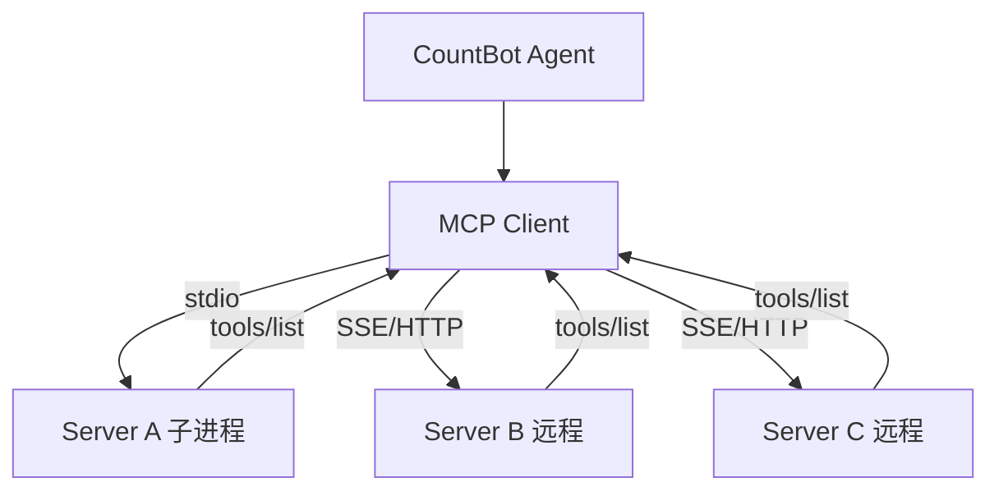

# MCP 客户端深度解析：Agent 的协议扩展

> 源码：[backend/modules/mcp/client.py](backend/modules/mcp/client.py) (~880 行)
> + [backend/modules/mcp/service.py](backend/modules/mcp/service.py), [backend/modules/mcp/exceptions.py](backend/modules/mcp/exceptions.py)
> 难度：⭐⭐ 需要了解网络协议和 JSON Schema
> 预计学习时间：1-2 天

---

## 🎯 一句话定义

**MCP 客户端让 CountBot 用一个统一协议自动发现并接入任意外部工具服务（数据库、SaaS、私有 API），不用为每个服务写适配代码。**

## ✅ TL;DR

- MCP = Agent-to-Tool 标准协议；三种传输：**stdio** / **SSE** / **Streamable HTTP**
- 客户端连上 Server 后**自动 list + 注册**工具，对 Agent 透明
- Schema **规范化**：把各 Server 的工具参数统一成 CountBot 内部格式
- 健壮性：健康检查 + **指数退避重连** + 单例延迟连接
- 在工具系统里，MCP 工具复用 `03` 的 `Tool` 接口，对 LLM 无感



---

## 📋 前置知识

- MCP（Model Context Protocol）的基本概念 —— Annotropic 提出的 Agent-to-Tool 标准协议
- 三种传输方式：stdio（子进程标准 IO）、SSE（Server-Sent Events）、Streamable HTTP
- JSON Schema 基础知识
- Python `AsyncExitStack`（异步资源管理）

---

## 🎯 核心概念

### MCP 是什么？为什么需要它？

传统方式：每接入一个外部工具服务，都要单独写适配代码。

MCP 方式：外部工具服务实现 MCP 协议 → CountBot 用一个客户端自动发现和注册所有工具：

```
CountBot (MCP Client)
    │
    ├──→ MCP Server A (stdio 进程)
    │     ├── tool: mcp_filesystem_read
    │     ├── tool: mcp_filesystem_write
    │     └── resource: mcp_filesystem_*  (文件资源)
    │
    ├──→ MCP Server B (SSE 连接)
    │     ├── tool: mcp_database_query
    │     └── prompt: mcp_database_schema  (Prompt 模板)
    │
    └──→ MCP Server C (Streamable HTTP)
          └── tool: mcp_github_create_issue
```

### 核心设计

```
McpClientManager (单例)
    │
    ├── 管理多个 MCP Server 连接
    ├── 健康检查（每 60s 检测连接状态）
    ├── 自动重连（指数退避）
    ├── 工具注册到 ToolRegistry
    └── WebSocket 状态广播
```

### 三种 Wrapper

MCP 协议有 tools、resources、prompts 三种能力，CountBot 分别为它们创建了 Wrapper，统一成 CountBot 的 Tool 接口：

| MCP 概念 | CountBot Wrapper | LLM 看到的 |
|----------|-----------------|-----------|
| Tool | `MCPToolWrapper` | 普通 tool，直接调用 |
| Resource | `MCPResourceWrapper` | 无参 tool，读取固定 URI |
| Prompt | `MCPPromptWrapper` | 带参 tool，获取 prompt 模板 |

---

## 🔍 关键代码路径

### 路径 1：连接一个 MCP Server [client.py:260-424]

```python
async def connect_mcp_server(name, config, registry, ...):
    # 1. 推断传输方式（命令 → stdio，URL → SSE 或 Streamable HTTP）
    transport_type = _infer_transport(config)

    # 2. 建立连接
    if transport_type == "stdio":
        # 启动子进程，通过 stdin/stdout 通信
        read, write = await stack.enter_async_context(stdio_client(server_params))
    elif transport_type == "sse":
        # HTTP SSE 连接
        read, write = await stack.enter_async_context(sse_client(url=config.url))
    elif transport_type == "streamable_http":
        # HTTP 流式连接
        read, write = await stack.enter_async_context(streamable_http_client(url=config.url))

    # 3. 初始化 MCP 会话
    session = await stack.enter_async_context(ClientSession(read, write))
    await session.initialize()

    # 4. 发现并注册 Tools
    tools_result = await session.list_tools()
    for tool_def in tools_result.tools:
        wrapper = MCPToolWrapper(session, name, tool_def)
        registry.register(wrapper)

    # 5. 可选：发现 Resources 和 Prompts
    if config.enable_resources:
        resources_result = await session.list_resources()
        for resource in resources_result.resources:
            registry.register(MCPResourceWrapper(session, name, resource))

    if config.enable_prompts:
        prompts_result = await session.list_prompts()
        for prompt in prompts_result.prompts:
            registry.register(MCPPromptWrapper(session, name, prompt))
```

### 路径 2：JSON Schema 规范化 [client.py:78-100]

```python
def _normalize_schema_for_openai(schema):
    """把 MCP 的 JSON Schema 转成 OpenAI Function Calling 兼容格式"""

    # 处理 "type": ["string", "null"] → "type": "string", "nullable": True
    if schema.get("type") in (["string", "null"], ["null", "string"]):
        schema = {**schema, "type": "string", "nullable": True}

    # 处理 anyOf → 提取非 null 的类型，标记 nullable
    if "anyOf" in schema:
        non_null = [s for s in schema["anyOf"] if s.get("type") != "null"]
        if len(non_null) == 1:
            merged = {**non_null[0], "nullable": True}
            schema = merged

    # 递归处理嵌套的 properties 和 items
    ...
```

**为什么需要这个**：MCP 的 JSON Schema 允许一些 OpenAI Function Calling 不支持的写法（如 `anyOf`、type 数组）。这个函数做了兼容转换，让 MCP 工具的参数能被 LLM 正确理解。

### 路径 3：健康检查与重连 [client.py:743-805]

```python
async def _health_check_loop(self):
    while self._connected and self._stacks:
        await asyncio.sleep(self._health_check_interval)  # 默认 60s

        for server_id, stack in list(self._stacks.items()):
            # 检查连接状态：遍历该 server 的所有工具，看底层 stream 是否关闭
            for name in self._mcp_tool_names:
                if name.startswith(f"mcp_{server_id}_"):
                    tool = self._registry._tools.get(name)
                    if tool and hasattr(tool, "_session"):
                        stream = tool._session._read_stream
                        if stream._state == "closed":
                            dead_servers.append(server_id)
                            break

        # 对失联的 server 启动重连
        for server_id in dead_servers:
            asyncio.create_task(self.reconnect_server(server_id))
```

**重连策略**：指数退避，最多 3 次尝试：5s → 10s → 20s。

### 路径 4：工具同步到新的 Registry [client.py:586-615]

```python
def sync_to_registry_sync(self, registry):
    """当新的 WebSocket 连接创建独立的 ToolRegistry 时，同步已连接的 MCP 工具"""
    for name, tool in self._tool_wrappers.items():
        if not registry.has_tool(name):
            registry.register(tool)
```

**为什么需要同步**：每个 WebSocket 连接有独立的 `ToolRegistry`（为了 contextvars 隔离），但 MCP 工具是全局共享的（因为 MCP 连接是全局的）。新 WebSocket 连接建立时，需要把已注册的 MCP 工具复制过去。

### 路径 5：Windows stdio 兼容 [client.py:40-65]

```python
def _normalize_windows_stdio_command(command, args, env):
    """Windows 下 .cmd/.bat 和 node 启动器需要用 cmd.exe 包装"""
    if os.name != "nt":
        return command, args, env
    base = command.lower()
    if base in ("npx", "npm", "pnpm", "yarn", "bunx"):
        # 这些是 shell 脚本，Windows 下需要 cmd /d /c 来执行
        return "cmd.exe", ["/d", "/c", command] + list(args), env
```

**为什么需要**：Windows 不能直接执行 `.cmd`/`.bat` 文件作为子进程，需要用 `cmd.exe /d /c` 包装。MCP 服务器通常通过 npx 启动，这在 Windows 上需要特殊处理。

---

## 💡 可深挖的逻辑

### 深度点 1：`connect_mcp_server` 的参数设计

`include_tools` / `exclude_tools` 支持通配符 `*` 和工具名精确匹配。这个白名单/黑名单机制让用户可以选择性暴露 MCP 工具：

```yaml
mcp:
  servers:
    - name: "filesystem"
      include_tools: ["*"]           # 全部暴露
    - name: "database"
      include_tools: ["query_table"]  # 只暴露一个
      exclude_tools: ["drop_table"]   # 排除危险操作
```

### 深度点 2：McpClientManager 的单例与延迟连接

```python
class McpClientManager:
    _instance = None

    async def ensure_connected(self):
        """延迟连接策略：首次访问时自动建立连接，而非启动时"""
        if self._connected:
            return True
        # 如果还没连接 → 尝试连接
        await self.connect(servers)
```

**设计考量**：如果 MCP 服务器在 CountBot 启动时还没准备好（比如在另一个 Docker 容器中），延迟连接允许 CountBot 先启动再等待 MCP 服务就绪。

### 深度点 3：`_execute_with_retry` 的瞬态错误判断

```python
_TRANSIENT_EXC_NAMES = frozenset((
    "ClosedResourceError", "BrokenResourceError", "EndOfStream",
    "BrokenPipeError", "ConnectionResetError", ...
))

def _is_transient(exc):
    return type(exc).__name__ in _TRANSIENT_EXC_NAMES
```

只有**瞬态错误**（连接断开等）才重试。MCP 协议层错误（如 tool not found）不重试，直接返回给 LLM。

---

## 🔧 技术选型分析：为什么 MCP 这样设计（Why）

### 决策 1：为什么用 MCP，而不是直接写每个工具的适配代码？
每接一个外部服务就写一套适配，是 N×M 的维护噩梦。MCP 把"工具发现 / 调用 / 资源 / 提示"标准化，CountBot 只需一个客户端，就能接入任意遵守协议的 Server——这是"**用协议换可扩展性**"。它也解释了 Q91 面经里的核心区别：MCP 是"工具协议"（Agent 连工具），A2A 是"Agent 间协议"（Agent 连 Agent），两者定位不同、可协同。

### 决策 2：为什么三种传输（stdio / SSE / Streamable HTTP）都要支持？
`stdio` 适合本地进程（如 filesystem、本地数据库），零网络、最低延迟；`SSE` / `HTTP` 适合远程托管的服务（如云端 GitHub、第三方 API）。覆盖三种，才能同时服务"本机工具"和"云上能力"，**不绑架部署形态**。传输方式由配置自动推断（命令 → stdio，URL → SSE / HTTP）。

### 决策 3：为什么要把 MCP 的 JSON Schema 规范成 OpenAI 兼容格式？
MCP 协议允许 `anyOf`、`type:["string","null"]` 等写法，而 OpenAI Function Calling 不支持。若直接把原始 schema 发往 LLM，会导致参数解析失败或工具不可用。`_normalize_schema_for_openai`（`client.py:78`）做"协议翻译"，让远端工具对 LLM 透明可用——这是兼容层，不是 hack。

### 决策 4：为什么健康检查靠"反查工具底层 stream 状态"，而不是维护独立连接表？
少维护一份状态就少一份不一致的风险。MCP 工具 wrapper 持有 `_session`，session 持有 `_read_stream`，**stream 关闭即代表连接断**。直接探这个信号，零额外状态、实时准确（`client.py:743`）。代价是探测逻辑和 wrapper 内部耦合，但换来了"连接状态永远真实"。

### 决策 5：为什么重连用指数退避（5s → 10s → 20s，最多 3 次）？
连续失败通常是服务端未就绪或网络抖动，立即猛重试会雪崩；退避给对端恢复时间，且封顶避免无限占用资源。3 次后仍失败则标记不可用并广播，交给人工 / 配置处理。这是"**自愈但有底线**"的标准做法。

### 决策 6：为什么 `McpClientManager` 用单例 + 延迟连接？
MCP 连接是**全局共享资源**（多个 WebSocket 会话共用同一组工具），单例避免重复连接；延迟连接（首次访问才连，而非启动时）让 CountBot 即使 MCP 服务暂未就绪也能先启动，提升部署韧性（`ensure_connected` 的懒加载语义）。

---

## 🛠️ 落地实施路径：怎么做（How）

### 路径 A：接入一个新的 MCP Server（最常见）
1. 在配置 `mcp.servers` 加一项：`{name:"github", command:"npx", args:["-y","@modelcontextprotocol/server-github"], env:{GITHUB_TOKEN:"..."}}`（stdio 例）或 `url:"https://..."`（SSE / HTTP 例）。
2. 用 `include_tools` / `exclude_tools` 控制暴露范围（如 `exclude_tools:["drop_table"]` 防危险操作，支持通配符 `*`）。
3. 重启 / 触发连接，观察日志里 `list_tools` 注册了哪些 `mcp_github_*` 工具。
4. 对话中直接让 Agent 调这些工具验证。

### 路径 B：编写一个自己的 MCP Server
若想把内部系统暴露给 CountBot：用官方 SDK（Python / TypeScript）实现 `list_tools` / `call_tool`，暴露成 stdio 或 HTTP。**CountBot 侧零代码改动即可接入**——这正是 MCP 的价值。验证：本地起一个返回当前时间的 MCP server，确认 Agent 能调通。

### 路径 C：增强 Schema 兼容性
遇到 MCP server 返回 CountBot 未处理的 schema 写法时，扩展 `_normalize_schema_for_openai`：新增分支处理该写法（如 `oneOf`、`const`），递归处理嵌套。改完用「练习 2」追踪转换全链路，确认 LLM 收到的 schema 合法。

### 路径 D：提升健壮性
- 把"瞬态错误重试"（深度点 3 `_is_transient`）从仅工具调用扩展到**连接建立阶段**。
- 对关键 server 加"连接健康度指标"暴露到监控，便于告警。
- 实现 A2A 协同（补 Q91）：若需 Agent 间通信，可在 MCP server 侧包装一个"呼叫其他 Agent"的 tool，或用专门的 A2A 网关——MCP 负责工具面，A2A 负责编排面。

### 路径 E：验证
- 连一个公网 MCP Server，确认工具注册与调用。
- `kill` 掉 server 进程，确认健康检查发现断连、退避重连、恢复。
- Windows 部署时确认 npx 类启动器被 `cmd.exe` 正确包装（`_normalize_windows_stdio_command`）。

---

## 🎤 面试话术

### 1.5 分钟版

> CountBot 集成了 MCP 客户端，支持 stdio、SSE、Streamable HTTP 三种传输协议。MCP 是 Anthropic 推动的 Agent-to-Tool 标准，让 Agent 用统一的方式连接外部工具服务。
>
> 实现上比较有意思的是 JSON Schema 的兼容处理——MCP 的 schema 允许 anyOf、null type 等写法，但这些在 OpenAI Function Calling 中不被支持，需要一个规范化层做转换。另外健康检查用了一个取巧的方法：遍历已注册工具反查底层 stream 状态，而不是维护额外的连接状态表。
>
> 还要处理一些平台细节——Windows 下 npx 这类 node 启动器不能直接作为子进程，需要用 cmd.exe 包装。

---

## ✏️ 练习建议

### 练习 1：手动测试 MCP 连接（1 小时）
找一个公开的 MCP Server（如 Puppeteer、GitHub），配置 CountBot 连接它，观察：
- 连接建立后注册了哪些工具
- 工具名称格式：`mcp_{server_name}_{tool_name}`
- 能否通过对话让 Agent 调用 MCP 工具

### 练习 2：追踪 Schema 转换（30 分钟）
找一个 MCP 工具的 schema 包含 `anyOf` 的，追踪 `_normalize_schema_for_openai()` 的完整转换过程，理解每一步做了什么。

### 练习 3：测试重连（30 分钟）
连接一个 MCP Server 后手动杀掉它（kill 进程），观察：
- 健康检查何时发现断连
- 重连尝试了几次
- 最终是否恢复

---

## 🔭 已知限制（诚实短板 · 对应面经题）

- **Schema 兼容边界**：各 Server 实现的 MCP 版本/字段可能不全，规范化时偶有字段丢失（已有降级处理，但非 100% 覆盖）。
- **SSE 探活依赖**：远程 Server 断连靠「反查 stream」探活，极端网络下可能有几秒盲区。
- **本质是「本地工具」**：MCP 让工具来源变多，但跨 Agent 调用仍受 `03` 的 A2A 限制（Q91）。

---

## 🧭 下一篇该读什么

→ **[07 渠道系统](07-channel-system.md)**。工具、协议都齐了，最后看「用户从哪个入口进来」——13 个 IM 平台如何被统一接入。

---

## ✅ 自测清单

1. 没有 MCP 之前，接一个外部工具要做什么？有了 MCP 后省了什么？
2. 三种传输（stdio/SSE/HTTP）各自适合什么部署场景？
3. MCP 工具对 LLM 来说是「特殊工具」吗？为什么？（提示：复用 `03` 接口）
4. Server 中途崩溃，客户端会怎样恢复？
5. MCP 能解决「跨 Agent 远程调用」吗？（提示：不能，见 Q91）
