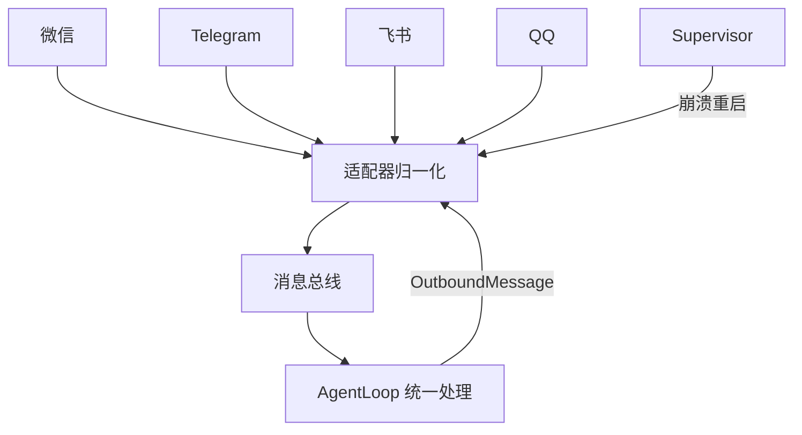

# IM 渠道系统：多入口统一接入

> 源码目录：[backend/modules/channels/](backend/modules/channels/)
> 核心文件：`manager.py` (410行), `handler.py` (2270行), `base.py`
> 难度：⭐ 工程量大但概念直观
> 预计学习时间：1 天

---

## 🎯 一句话定义

**渠道系统用适配器模式把 13 个 IM 平台（微信/Telegram/飞书…）统一成 `InboundMessage` / `OutboundMessage`，让上层 Agent 不关心消息从哪来。**

## ✅ TL;DR

- 13 个渠道各自实现统一适配器接口，消息归一化后交给 `AgentLoop`
- 每个渠道跑独立**协程/进程**，`Supervisor` 监控崩溃自动重启
- 重启退避有**上限**（约 60s），避免雪崩
- 归一身后的消息走**消息总线**解耦，支持多账号



---

## 📋 前置知识

- HTTP Webhook 机制（IM 平台把消息通过 HTTP 请求推给你的服务器）
- WebSocket 长连接（部分渠道需要主动建立连接）
- Supervisor 模式（监控子进程/任务，崩溃自动重启）
- 消息队列（生产者-消费者模式）

---

## 🎯 核心概念

### 这个模块解决什么问题？

不同 IM 平台的消息格式、认证方式、投递机制完全不同。Channel 层用**适配器模式**把它们统一为 `InboundMessage` 和 `OutboundMessage`，上层代码不需要关心消息是从微信还是 Telegram 来的。

```
八种渠道 → 统一模型

微信    ─┐
QQ      ─┤
Telegram─┤
钉钉    ─┼──→ InboundMessage ──→ AgentLoop ──→ OutboundMessage ──→ 对应渠道发出
飞书    ─┤    (统一格式)                    (统一格式)
企微    ─┤
微博    ─┤
小智AI  ─┘
```

### 核心设计

```
ChannelManager
├── 初始化：根据配置动态加载渠道类（注册表 + __import__）
├── 启动：每个渠道在独立的 asyncio Task 中运行
├── 监督：渠道崩溃后自动重启（指数退避 5s → 300s）
├── 路由：出站消息按 channel + account_id 找到正确的渠道实例
└── 多账号：同一渠道可运行多个机器人账号
```

---

## 🔍 关键代码路径

### 路径 1：动态加载 [manager.py:50-85]

```python
_CHANNEL_REGISTRY = {
    "telegram": ("backend.modules.channels.telegram", "TelegramChannel"),
    "qq":       ("backend.modules.channels.qq", "QQChannel"),
    "wechat":   ("backend.modules.channels.wechat", "WeChatChannel"),
    ...
}

def _init_channels(self):
    for name, (module_path, class_name) in _CHANNEL_REGISTRY.items():
        channel_cfg = getattr(channels_config, name, None)
        if not channel_cfg or not channel_cfg.enabled:
            continue  # 未启用的渠道直接跳过

        # 动态导入渠道类
        module = __import__(module_path, fromlist=[class_name])
        cls = getattr(module, class_name)

        # 为每个启用的 account 创建独立实例
        for instance_key, instance_cfg, account_id in instances:
            channel = cls(instance_cfg)
            self.channels[instance_key] = channel
```

**设计要点**：渠道是通过字符串注册表动态加载的，不是硬编码的 import。这样渠道的依赖缺失（如 `wechatpy` 没装）不会影响其他渠道。

### 路径 2：Supervisor 重启 [manager.py:223-256]

```python
async def _start_channel_supervised(self, name, channel):
    initial_backoff = 5    # 第一次重连等 5 秒
    max_backoff = 300      # 最长等 5 分钟
    backoff = initial_backoff

    while self._running:
        start_time = asyncio.get_event_loop().time()
        try:
            await channel.start()
            # 渠道正常运行...（阻塞在这里直到 crash）
        except Exception as e:
            logger.error(f"Channel {name} error: {e}")

        # 如果成功运行超过 60 秒，重置退避时间
        elapsed = asyncio.get_event_loop().time() - start_time
        if elapsed > 60:
            backoff = initial_backoff

        await asyncio.sleep(backoff)
        backoff = min(backoff * 2, max_backoff)  # 指数增长
```

**为什么 60 秒是分界线**：如果渠道稳定运行超过 60 秒后 crash，说明不是配置问题而是偶发网络问题，重置退避时间可以快速重试。反之，如果启动后立即 crash，说明可能是配置错误，逐步拉长重试间隔避免刷日志。

### 路径 3：多账号支持 [manager.py:91-190]

同一渠道可以配置多个账号（比如公司有两个飞书机器人：客服机器人和内部通知机器人）。每个账号有独立的 `instance_key = "{channel_name}:{account_id}"`，消息路由时根据 `account_id` 找到正确的实例。

**去重检查**：通过 `unique_field_map`（如 Telegram 的 token、微信的 login_bot_id）检测同一个物理机器人是否被配置了多次。

### 路径 4：消息总线 [manager.py:262-287]

```
入站: Channel._on_message → ChannelManager._on_inbound_message → bus.publish_inbound(msg)
出站: bus.consume_outbound() → ChannelManager._dispatch_outbound → channel.send(msg)
```

使用企业消息队列（`EnterpriseMessageQueue`）解耦渠道层和 Agent 层。渠道不需要知道 Agent 怎么处理消息，Agent 不需要知道消息发到哪个渠道。

---

## 💡 可深挖的逻辑

### 深度点 1：handler.py 的 2270 行

这是整个项目中**最大的单文件**。它处理：
- 命令识别（`/new`, `/m`, `/team` 等）
- 消息预处理（去掉 @mention、清理格式）
- 会话管理（获取/创建 Session）
- Agent 调度（创建 AgentLoop → 流式输出 → 回传渠道）

**阅读建议**：从 `handle_message()` 入口开始追踪，理解一次完整的消息处理流程。不用逐行读，理解主要分支即可。

### 深度点 2：渠道实例的去重签名

`build_signature()` 方法为每个渠道配置生成唯一的物理签名（如 telegram 用 token、wechat 用 login_bot_id）。同一个物理机器人被配置了两次时，第二次会被跳过并打 warning 日志。

---

## 🔧 技术选型分析：为什么渠道系统这样设计（Why）

### 决策 1：为什么用适配器模式 + 注册表动态加载？
8 种 IM 平台的消息格式 / 认证 / 投递机制各不相同。硬编码 import 会让"缺一个依赖（如 `wechatpy` 没装）就崩所有渠道"。注册表 + `__import__` 动态加载，让**未启用 / 依赖缺失的渠道静默跳过，互不影响**——这是"故障隔离"在模块加载层面的体现。代价是加载路径略隐式，但换来部署健壮性。

### 决策 2：为什么每个渠道跑在独立 Supervisor 任务里、崩溃自动重启？
IM 渠道是长连接（WebSocket / 轮询），网络抖动、token 失效会导致偶发崩溃。把每个渠道放进 `while self._running` 的监督循环，崩溃后指数退避重启（5s → 300s），保证"服务尽可能在线"。把"渠道存活"和"主进程"解耦，一个渠道挂了不拖垮全局。

### 决策 3：为什么 60 秒是退避重置的分界线？
稳定运行 >60s 后崩溃，大概率是偶发网络问题，快速重试合理；启动即崩，大概率是配置错误（token 错、端口错），拉长间隔避免狂刷错误日志、也避免对坏配置做无用功。这是一个用"**运行时行为反推故障性质**"的巧思——同一套退避，对不同故障给出不同节奏。

### 决策 4：为什么用消息总线（`EnterpriseMessageQueue`）解耦渠道层与 Agent 层？
渠道只管"收到消息 → publish；要发消息 → consume"，Agent 只管处理。两者通过队列解耦后：① 可独立扩容（多 Agent 实例消费同一总线）；② 渠道崩溃不影响在途消息；③ 新增渠道不改 Agent 代码。这是典型的"生产者-消费者"松弛耦合。

### 决策 5：为什么支持同一渠道多账号？
真实场景：一个公司有两个飞书机器人（客服号 + 内部通知号）。用 `instance_key = channel:account_id` 区分，路由按 account 找到正确实例；去重签名（`build_signature`）防止同一物理机器人配两次。这是"**多租户 / 多身份**"在渠道层的落地。

### 决策 6：为什么是这 8 种渠道？
覆盖了国内外主流 IM 入口（微信、QQ、Telegram、钉钉、飞书、企微、微博、小智 AI）。选择标准是"用户真实在用的入口"，而非技术新颖度——项目定位是"能多渠道触达的 Agent"，广度即价值。

---

## 🛠️ 落地实施路径：怎么做（How）

### 路径 A：新增一个 IM 渠道
1. 在 `backend/modules/channels/` 新建 `mychan.py`，继承 `BaseChannel`，实现：`start()`（建连 / 轮询）、`_on_message()`（转成 `InboundMessage`）、`send(OutboundMessage)`（发回平台）。
2. 在 `manager.py` 的 `_CHANNEL_REGISTRY` 登记 `("mychan", "backend.modules.channels.mychan", "MyChannel")`。
3. 在配置启用该渠道并填凭证。
4. **关键**：所有消息必须归一化成 `InboundMessage` / `OutboundMessage`，上层才能无感处理——这是适配器模式的契约，违反它就会把渠道差异泄漏到 Agent 层。

### 路径 B：给渠道加"消息预处理"能力
在 `handler.py` 的 `handle_message` 入口（命令识别、`@mention` 清理之后）加钩子，例如"把语音消息转文本再进 Agent"。注意保留原有**去重与会话绑定**逻辑，避免破坏消息幂等性。

### 路径 C：提升可靠性
- 对关键渠道加"启动即崩"的快速失败告警（避免静默不可用）。
- 给消息总线加持久化 / 重试，防止 Agent 处理慢时入站消息丢失。
- 监控每个渠道的"重连次数"，超过阈值告警（可能凭证过期）。

### 路径 D：端到端验证
- 建一个 Telegram Bot（练习 1），端到端发消息走通。
- 从 `_on_inbound_message` 加日志，画出"渠道 → 总线 → Agent → 总线 → 渠道"的时序图。
- 故意填错 token，确认 Supervisor 重启与退避行为符合预期（先 5s、再 10s、再指数增长，稳定运行 60s 后重置）。

### 路径 E：与 Agent 能力联动
渠道只是入口——真正的能力在 `AgentLoop` / `Workflow` / `Tool` / `MCP`。理解这一点，就能回答面试经典问题"你的 Agent 多渠道接入是怎么做到的"：**渠道层做归一化，Agent 层做智能化，两层通过消息总线解耦，互不污染。**

---

## 🎤 面试话术

### 1 分钟版

> CountBot 支持 8 种 IM 渠道的统一接入。核心是适配器模式——每个渠道实现统一的 `BaseChannel` 接口，ChannelManager 通过注册表动态加载。渠道在独立的 supervisor 任务中运行，崩溃后指数退避自动重连。支持同一渠道运行多个机器人账号，通过消息总线解耦渠道层和 Agent 层。

---

## ✏️ 练习建议

### 练习 1：创建一个 Telegram Bot（1 小时）
1. 在 Telegram 创建 Bot（通过 @BotFather 获取 token）
2. 在 CountBot 配置中启用 Telegram 渠道
3. 给 Bot 发消息，观察整个流程

### 练习 2：追踪消息处理全流程（1 小时）
从 `_on_inbound_message` 开始，加日志追踪一条消息从进来到 AgentLoop 处理完毕返回给渠道的完整路径。画出时序图。

### 练习 3：测试 Supervisor 重启（30 分钟）
故意让一个渠道 crash（比如提供无效的 API token），观察日志中的重启行为和退避时间变化。

---

## 🔭 已知限制（诚实短板 · 对应面经题）

- **多账号能力**：部分渠道支持多账号，但配置与隔离逻辑分散，尚未完全统一。
- **消息总线解耦程度**：总线已解耦，但个别渠道仍有同步阻塞点，高并发下可能成瓶颈。
- **本质是「入口」**：渠道不感知 Agent 内部逻辑，所有智能都在 upstream 的 `01~06`。

---

## 🧭 下一篇该读什么

→ 回到 **[00 前置知识](00-prerequisites.md)** 或**直接动手**：`python start_app.py` 把整套跑起来，对照 8 篇看真实数据流。

---

## ✅ 自测清单

1. 适配器模式在这里解决了什么问题？如果加第 14 个渠道要改上层吗？
2. Supervisor 为什么要「退避」而不是「立刻重启」？
3. 一条微信消息从进来到 Agent 回复，经过了哪几个组件？
4. 渠道系统需要知道「Agent 怎么推理」吗？为什么？
5. 高并发下，渠道层的潜在瓶颈可能在哪？
